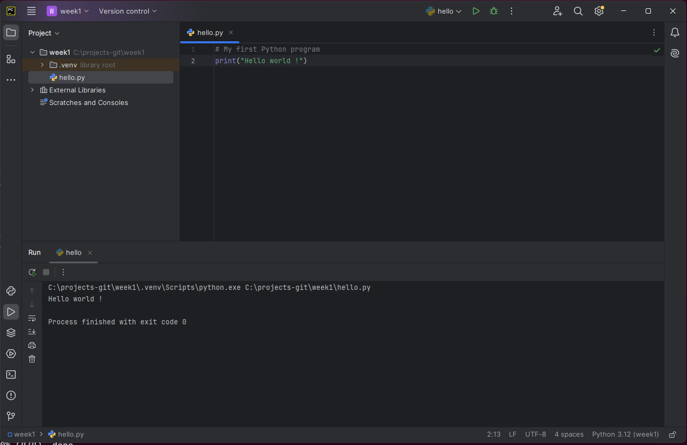
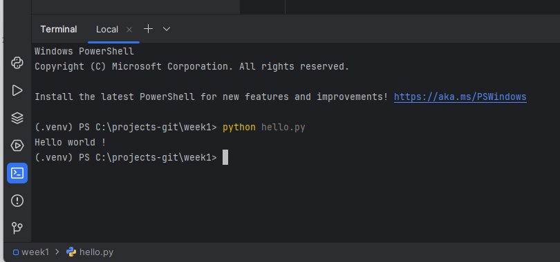
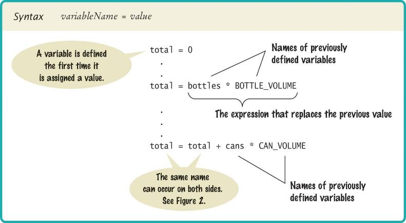
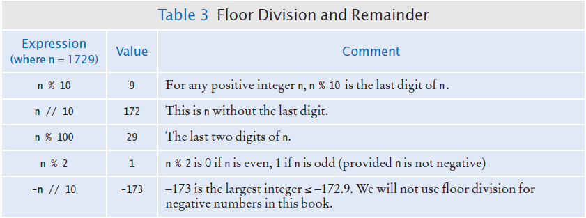

# Chapter One: Getting Started with Python

Your **first Python program**, then the two data types you will use in almost every program you ever write: **numbers** and **strings**. Along the way: variables, arithmetic, input and output, and how to read the three kinds of error Python can give you.

[← Back to Course Index](../table-of-contents.md)

---

## Chapter Goals

In this chapter you will **learn**:

- What **Python** is, how the interpreter runs your code, and how to set up **PyCharm**
- To write, save, and run a first program using **`print()`**
- To declare and initialize **variables** and **constants**, and to understand **integers**, **floating-point numbers**, and **strings**
- To write **arithmetic expressions** and **assignment statements**, and to use Python's **standard library** (such as the `math` module)
- To **plan a solution** with **pseudocode** and to **work a problem by hand** before coding it
- To work with **strings** — indexing, slicing, and methods
- To read and process **input**, and display **formatted results** with f-strings
- To tell **syntax errors**, **run-time exceptions** (tracebacks), and **logic errors** apart

---

## Chapter Contents

- **1.1 The Python Language** — History, key features, and how your code actually runs
- **1.2 Your Programming Environment** — PyCharm, script vs. interactive mode, organizing your files
- **1.3 Your First Program** — `print()`, comments, and calling functions
- **1.4 Variables and Types** — Naming, assignment, types, constants, and comments
- **1.5 Arithmetic** — Operators, precedence, floor division, modulus, the `math` module, and type conversion
- **1.6 Problem Solving: Plan Before You Code** — Algorithms, pseudocode, and working an example by hand
- **1.7 Strings** — Length, concatenation, repetition, indexing, slicing, and methods
- **1.8 Input and Output** — Reading input with `input()` and formatting with f-strings
- **1.9 Errors and Debugging** — Syntax, run-time, and logic errors, plus the pitfalls every beginner hits

---

## 1.1 The Python Language

### A Short History

Python was created by **Guido van Rossum**, a Dutch programmer, who began working on it in December 1989 as a Christmas holiday project. The first version was released in 1991.

**The name "Python"**: contrary to popular belief, Python is not named after the snake. Van Rossum was a fan of the British comedy group **Monty Python's Flying Circus**, and wanted a name that was short, unique, and slightly mysterious.

Van Rossum was working at the **Centrum Wiskunde & Informatica (CWI)** in the Netherlands when he became frustrated with the limitations of existing programming languages. He wanted a language that would be **easy to read and write**, have a **simple and consistent syntax**, be **powerful enough** for real-world applications, and allow **rapid development**.

Python follows a design philosophy emphasizing **readability** and **simplicity**. The language's guiding principles (known as "The Zen of Python") prioritize code that is easy to read, understand, and maintain.

### Key Features

Python has become popular because of several key features:

- **Simple and clean syntax**: much simpler than Java, C, and C++ (making it easier to learn)
- **Interpreted workflow**: you write a `.py` file and run it — there is **no separate compile command** the way there often is in C or C++
- **High-level language**: handles memory management and low-level details automatically
- **Dynamically typed**: no need to declare variable types
- **Extensive standard library**: "batteries included" philosophy — many tools built in
- **Cross-platform**: runs on Windows, macOS, Linux, and more
- **Large ecosystem**: thousands of third-party packages available via PyPI (the Python Package Index)
- **Great community**: active and helpful, with extensive documentation

Python is consistently ranked among the top programming languages because it is used for **web development** (Django, Flask), **data science and machine learning** (NumPy, Pandas, TensorFlow, PyTorch), **scientific computing** (SciPy, Matplotlib), **automation and scripting**, **game development** (Pygame), **desktop applications**, and much more.

### How Python Runs Your Code

You only ever **run** your program — there is no manual compile step like in many C workflows. Internally, though, a typical run looks like this:

1. **Bytecode compilation** (part of the interpreter) reads your source and generates **bytecode** — compact instructions for the **Python Virtual Machine (PVM)**
2. **The PVM** executes that bytecode (in the same way your CPU executes machine instructions, but at a higher level)
3. **Libraries** (for example, the `math` module) are automatically located and included when needed

 → running program")

That "no compile step" idea refers to **what you do**: you do not manually build a binary before each run. Python still translates your source to bytecode inside the interpreter and runs that on the virtual machine — so "interpreted" and "**bytecode compiler → bytecode → VM**" describe the same pipeline from two angles. This is why both "run immediately" and "bytecode + VM" show up in books and documentation.

> **Optional reading** (explore on your own — not required for the first session)
>
> - **The Zen of Python** — In interactive Python, run `import this` to print the short aphorisms behind Python's readability-focused design.
> - **Official tutorial** — The Python documentation includes a gentle introduction for newcomers: [The Python Tutorial](https://docs.python.org/3/tutorial/).

---

## 1.2 Your Programming Environment

There are two common ways of creating a computer program:

1. **Using an Integrated Development Environment (IDE)**
   - Provides tools for writing, testing, and debugging code
   - Examples: PyCharm, Visual Studio Code, IDLE

2. **Using a text editor**
   - Simple text editors such as Notepad, TextEdit, or vim
   - Requires running the program from a command line

**For this course, we will use the PyCharm IDE throughout.**

### What an IDE Gives You

The source code editor in an IDE helps you program by:

- **Listing line numbers** of code (makes debugging easier)
- **Color-coding** lines of code (comments, keywords, text, etc.)
- **Auto-indenting** source code (maintains proper structure)
- Providing an **output window** (shows program results and error messages)
- Providing a **debugger** (helps find and fix errors in your code)



Take the time early in the semester to learn your way around PyCharm. Time spent here pays off all term, because it lets you focus on the language instead of on the tool.

### Two Ways to Run Python

**Script mode.** You write and save a complete Python program in a `.py` file, and the interpreter executes the instructions all at once. This is how you will submit your labs and assignments.

**Interactive mode.** You run instructions one at a time by typing Python statements directly into a console window. Interactive mode is excellent for quick experiments — testing what an operator does, checking a function's output, or reproducing an error message. To start it, type `python` (or `python3`) in your terminal, or use the Python Console inside PyCharm.

Throughout this chapter you will see "try it" suggestions. Interactive mode is the fastest way to try them.

### Organize Your Work

Your **source code** is stored in `.py` files. Some best practices:

1. **Create a folder for this course**
2. **Create one folder per program** inside the course folder
3. **A program can consist of several `.py` files** (as you will learn later)
4. **Be sure you know where your IDE stores your files** — you need to be able to find them

Always back up your work: to a USB flash drive, a network drive, or cloud storage (Google Drive, Dropbox, OneDrive, iCloud Drive).

> **Pro tip:** Use version control (like Git) to track changes and back up your code professionally.

---

## 1.3 Your First Program

### "Hello, World!"

The traditional **"Hello World"** program is the first program most students write. Type the following into the PyCharm editor:

```python
# My first Python program
print("Hello, World!")
```

**Save your file as `hello.py`** and run it.

**Output:**

```
Hello, World!
```

> **Important reminders**
>
> - **Python is case sensitive** — `Print` is different from `print`. Enter upper and lower case letters exactly as they appear.
> - Be careful of spelling (`print` vs. `primt`). A typo in a name is usually a **`NameError` when that line runs**, not a `SyntaxError`. See [Section 1.9](#19-errors-and-debugging).
> - Typing the program in yourself is far better practice than copying and pasting it.

### Analyzing the Program

A Python program contains one or more lines of instructions (**statements**) that will be translated and executed by the interpreter.

**Line 1:** `# My first Python program`

- This is a **comment** — descriptive information about the program, written for other programmers
- Comments are ignored by Python when the program runs
- The `#` symbol starts a comment (more on comments in [Section 1.4](#comments-in-python))

**Line 2:** `print("Hello, World!")`

- This is a **statement** that prints a line of text onscreen
- `print()` is a **built-in function**
- `"Hello, World!"` is a **string** — text enclosed in quotes

### The `print()` Function

A **function** is a collection of programming instructions that carry out a particular task (in this case, printing a value onscreen). **It is code that somebody else wrote for you!** Python provides many built-in functions like `print()` that you can use without writing them yourself.

To use, or **call**, a function in Python you specify:

1. **The name of the function** you want to use (here, `print`)
2. **Any values (arguments)** the function needs to carry out its task (here, `"Hello, World!"`)

 syntax: all arguments are optional; values are printed one after another, separated by a space")

**Syntax rules:**

- Arguments are enclosed in **parentheses**: `print(...)`
- Multiple arguments are separated with **commas**: `print("Hello", "World")`
- A sequence of characters enclosed in quotation marks is called a **string**

### More Examples of `print()`

**Printing a numerical value** — the expression is evaluated first, then the result is displayed:

```python
print(3 + 4)
```

**Output:** `7`

**Passing multiple values** — each value is displayed one after another, with a blank space between them:

```python
print("the answer is", 6 * 7)
```

**Output:** `the answer is 42`

**Multiple print statements** — by default, `print()` starts a new line after its arguments:

```python
print("Hello")
print("World!")
```

**Output:**

```
Hello
World!
```

### Your Second Program: `printtest.py`

```python
##
#  Sample program that demonstrates the print function
#

#  Prints 7
print(3 + 4)

#  Print Hello World! on two lines
print("Hello")
print("World!")

#  Print multiple values with a single print function call
print("My favorite numbers are", 3 + 4, "and", 3 + 10)

#  Print with an empty line
print("Goodbye")
print()
print("Hope to see you again")
```

**Expected output:**

```
7
Hello
World!
My favorite numbers are 7 and 13
Goodbye

Hope to see you again
```

> **Watch the commas.** Every value in a `print()` call must be separated by a comma. Writing `print("and" 3 + 10)` instead of `print("and", 3 + 10)` is a very common typo. Try it on purpose — Python answers with `SyntaxError: invalid syntax. Perhaps you forgot a comma?`, which tells you exactly what to fix.

### Running Without an IDE

You can also write source code in a plain text editor. Once saved as `hello.py`, you run it from a console window:



Python prepares the bytecode internally; you do not run a separate compile step first. Using an IDE like PyCharm is still recommended for beginners, since it provides helpful features and error checking.

---

## 1.4 Variables and Types

### What Is a Variable?

A **variable** is a named storage location in a computer program. There are many different types of variables, each used to store different things.

You **define** a variable by telling Python:

- What name you will use to refer to it
- The initial value of the variable

### The Assignment Statement

Use the **assignment statement** `=` to place a value into a variable:

```python
pizzas = 3   # defines and initializes the variable pizzas
```

The value on the right of the `=` sign is assigned to the variable on the left.



> **Important:** The `=` sign is **not** used for comparison. It copies the value on the right side into the variable on the left side. You will learn about the comparison operator in the next chapter.

### A Small Example

You order some pizza. Three facts about that order, and three variables to hold them:

```python
pizzas = 3        # how many pizzas — a whole number
price = 12.99     # what one costs  — has a fractional part
name = "Sam"      # who ordered it  — text
```

Three variables, three different **types**. The next section explains why the type matters.

### Data Types: `int`, `float`, and `str`

There are three types of data we will use in this chapter:

- **Integer (`int`)**: a whole number, with no fractional part — `7`
- **Float (`float`)**: a number with a fractional part — `8.88`
- **String (`str`)**: a sequence of characters — `"Bob"`

> **Key point:** The data type is associated with the **value**, not the **variable**.

```python
pizzas = 3            # int
pizza_price = 12.99   # float
```

### Asking Python: the `type()` Function

If you are ever unsure what type a value or variable has, ask Python with the built-in `type()` function:

```python
print(type(6))         # <class 'int'>
print(type(12.0))      # <class 'float'>
print(type("Bob"))     # <class 'str'>
print(type(True))      # <class 'bool'>

pizzas = 3
print(type(pizzas))    # <class 'int'>

pizzas = 3.0
print(type(pizzas))    # <class 'float'>  ← the type follows the new value
```

Things to notice:

- `type(x)` returns the **class** of the value `x`. The output `<class 'int'>` simply means "this value's type is `int`".
- The same variable can show different types over time, because the type belongs to the **value** currently stored, not to the variable name.
- `type()` is one of your best **debugging tools**. When a calculation produces a surprising result or a `TypeError`, drop in `print(type(some_variable))` to see what Python actually has.

### Updating a Variable

If an existing variable is assigned a new value, that value **replaces** the previous contents:

```python
pizzas = 3
pizzas = 5  # the value 3 is replaced with 5
```

A variable can also be updated from its own current value:

```python
pizzas = pizzas + 2
```

**Step by step:**

1. **Step 1:** Calculate the right-hand side of the assignment. Find the value of `pizzas`, and add 2 to it.
2. **Step 2:** Store the result in the variable named on the left side of the assignment operator.

### Augmented Assignment Operators

Self-updates like `x = x + 2` are so common that Python provides shorter **augmented assignment** operators:

| Operator | Equivalent to | Example           |
| -------- | ------------- | ----------------- |
| `+=`     | `x = x + n`   | `pizzas += 2`     |
| `-=`     | `x = x - n`   | `count -= 1`      |
| `*=`     | `x = x * n`   | `total *= 1.05`   |
| `/=`     | `x = x / n`   | `price /= 2`      |
| `//=`    | `x = x // n`  | `pages //= 10`    |
| `%=`     | `x = x % n`   | `index %= length` |
| `**=`    | `x = x ** n`  | `value **= 2`     |

```python
pizzas = 3
pizzas += 2   # pizzas is now 5
```

### Multiple Assignment

You can assign several variables in a single statement:

```python
x, y = 10, 20            # x is 10, y is 20
first_name, last_name = "Harry", "Morgan"
a = b = c = 0            # a, b, and c are all 0
```

### ⚠️ A Warning About Variable Types

Since the data type is associated with the **value** and not the **variable**, a variable can be assigned different types at different places in a program:

```python
tax_rate = 5              # an int
# ... later in the program ...
tax_rate = 5.5            # a float
# ... and then ...
tax_rate = "Non-taxable"  # a string
```

> **Warning:** If you use a variable and it has an unexpected type, an error will occur in your program. It is best practice to keep the same type for a variable throughout your program.

### Try It: `typetest.py`

1. Open PyCharm and create a new file
2. Type in the following code
3. Save the file as `typetest.py`
4. Run the program

```python
# Testing different types in the same variable
tax_rate = 5  # int
print(tax_rate, type(tax_rate))

tax_rate = 5.5  # float
print(tax_rate, type(tax_rate))

tax_rate = "Non-taxable"  # string
print(tax_rate, type(tax_rate))

print(tax_rate + 5)  # This will cause an error!
```

The last line causes a `TypeError`, because you cannot add a number to a string.

**Now a minor change.** Change the last line to read:

```python
print(tax_rate + "??")
```

Save and run again. **What is the result?**

When you use the `+` operator with two strings, the second is **concatenated** (joined) onto the end of the first. This works because both operands are strings. We will cover string operations in detail in [Section 1.7](#17-strings).

### Number Literals in Python

| Number    | Type    | Comment                                                                |
| --------- | ------- | ---------------------------------------------------------------------- |
| `6`       | `int`   | An integer has no fractional part.                                     |
| `-6`      | `int`   | Integers can be negative.                                              |
| `0`       | `int`   | Zero is an integer.                                                    |
| `0.5`     | `float` | A floating-point number has a fractional part.                         |
| `1.0`     | `float` | A `float` even when the fractional part is zero — different from `1`.  |
| `1e3`     | `float` | Exponential (scientific) notation: `1 × 10³` = `1000.0`.               |
| `3,000`   | error   | Do **not** use commas as thousands separators inside numeric literals. |
| `3 1/2`   | error   | Mixed numbers are not allowed; use `3.5` or `7 / 2`.                   |

### Naming Variables

Variable names should describe the purpose of the variable. For example, `pizza_price` is better than `pp`.

**Rules for variable names:**

- Names must start with a letter or the underscore (`_`) character
- Continue with letters (upper or lower case), digits, or the underscore
- You cannot use other symbols (`?`, `%`, etc.), and spaces are not permitted
- Do not use **reserved** Python words (like `if`, `for`, `while`, etc.)
- Separate words by a **convention** — most languages have a preferred style for multi-word names

### `snake_case` vs. `camelCase`

| Style          | Example       | Where it's the convention                                   |
| -------------- | ------------- | ----------------------------------------------------------- |
| **snake_case** | `pizza_price` | **Python (PEP 8)**, Ruby, Rust                              |
| **camelCase**  | `pizzaPrice`  | Java, JavaScript, TypeScript, C#, Swift                     |
| **PascalCase** | `PizzaPrice`  | Reserved in Python for **class names** only — not variables |

In Python, the official style guide ([PEP 8](https://peps.python.org/pep-0008/#function-and-variable-names)) recommends **`snake_case`**: lowercase letters with underscores between words. The Python standard library, the most popular third-party packages (`requests`, `numpy`, `pandas`, …), and most professional Python codebases all follow this convention.

```python
# ✅ Pythonic (snake_case) — preferred
pizzas = 3
pizza_price = 12.99
total_cost = pizzas * pizza_price

# ⚠️ Legal but non-Pythonic (camelCase)
numPizzas = 3
pizzaPrice = 12.99
totalCost = numPizzas * pizzaPrice
```

> **For this course, use `snake_case` for all variable and function names**, `UPPER_SNAKE_CASE` for constants, and `PascalCase` for class names (which we will meet later). If you have seen `camelCase` in older Python textbooks, that is why — but `snake_case` is what real Python code uses.

**Examples:**

| Variable Name      | Comment                                                                           |
| ------------------ | --------------------------------------------------------------------------------- |
| `pizza_price`      | ✅ Good — descriptive, `snake_case` (PEP 8).                                      |
| `slices_per_pizza` | ✅ Good — multiple words separated by underscores.                                |
| `pp`               | ⚠️ Legal but cryptic — what does `pp` mean?                                       |
| `pizzaPrice`       | ⚠️ Legal but non-Pythonic — `camelCase` is the convention in Java/JS, not Python. |
| `PizzaPrice`       | ⚠️ Legal but reserved by convention for **class names**, not variables.           |
| `_price`           | ✅ Legal — a single leading underscore signals "internal use".                    |
| `4pizzas`          | ❌ Error — variable names cannot start with a digit.                              |
| `pizza price`      | ❌ Error — spaces are not allowed in identifiers.                                 |
| `pizza-price`      | ❌ Error — `-` is the subtraction operator, not a name character.                 |
| `if`               | ❌ Error — `if` is a reserved Python keyword.                                     |
| `Print`            | ⚠️ Legal but confusing — Python is case-sensitive, so `Print` ≠ `print`.          |

> **Programming tip.** Choose descriptive names. `pizza_price = 12.99` is clear; `pp = 12.99` is not. This matters especially when programs are written by more than one person.

### Constants

In Python, a **constant** is a variable whose value **should not** be changed after it is assigned an initial value. It is good practice to use **all caps** when naming constants:

```python
SLICES_PER_PIZZA = 8
MAX_SIZE = 100
tax_rate = 5           # a variable, not a constant
```

Using named constants explains numerical values in calculations. Which is clearer?

```python
total_slices = pizzas * 8                    # What does 8 mean?
total_slices = pizzas * SLICES_PER_PIZZA     # Much clearer!
```

A programmer reading the first statement may not understand the significance of the `8`.

> **Note:** Python will let you change the value of a constant, but just because you can do it does not mean you should.

### Comments in Python

Use comments at the beginning of each program, and to clarify details of the code. Comments are:

- A courtesy to others
- A way to document your thinking
- Explanations for humans who read your code

The Python interpreter **ignores** comments when executing your program.

**Style 1 — a comment on its own line, above the code it describes:**

```python
##
#  This program works out the cost of a pizza order.
#

# Price of one pizza, in dollars.
PIZZA_PRICE = 12.99

# Number of pizzas ordered.
pizzas = 3

# Work out the total.
total = pizzas * PIZZA_PRICE
print(total)
```

**Style 2 — a short comment at the end of the line:**

```python
##
#  This program works out the cost of a pizza order.
#

PIZZA_PRICE = 12.99      # Price of one pizza, in dollars
pizzas = 3               # Number of pizzas ordered

total = pizzas * PIZZA_PRICE
print(total)
```

Both styles are fine. Pick one and use it consistently.

**Multiline comments.** Unlike JavaScript, Java, and C++, which use `/* ... */`, Python has no built-in mechanism for multi-line comments.

*Option 1* — insert a `#` on each line:

```python
# This is a comment
# written in more than
# just one line
```

*Option 2* — use **docstrings** (triple quotes). Python ignores string literals that are not assigned to a variable, so you can place your comment inside one:

```python
"""
This is a comment
written in more than just one line"""
print("Hello, World!")
```

**Output:**

```
Hello, World!
```

### Undefined Variables

You must **define a variable before you use it** — it must be defined somewhere above the line where you first use it.

**❌ Incorrect order:**

```python
total_cost = pizzas * pizza_price   # Error! pizza_price not defined yet
pizza_price = 12.99
```

**✅ Correct order:**

```python
pizza_price = 12.99
total_cost = pizzas * pizza_price   # Now pizza_price is defined
```

---

## 1.5 Arithmetic

### Basic Arithmetic Operations

Python supports all of the basic arithmetic operations:

- **Addition**: `+`
- **Subtraction**: `-`
- **Multiplication**: `*`
- **Division**: `/`

You write expressions much as you do in mathematics, but with Python syntax. Everything goes on a single line, and grouping is done with parentheses:

 / 2 written as a fraction")

becomes

 / 2")

### Operator Precedence

Precedence is similar to algebra, following **PEMDAS**:

1. **P**arentheses
2. **E**xponent
3. **M**ultiply / **D**ivide (left to right)
4. **A**dd / **S**ubtract (left to right)

### Mixing Numeric Types

If you mix integer and floating-point values in an arithmetic expression, the result is a **floating-point value**:

```python
7 + 4.0    # yields the floating value 11.0
```

You can confirm this with `type()`:

```python
print(type(7 + 4))     # <class 'int'>    — int + int → int
print(type(7 + 4.0))   # <class 'float'>  — int + float → float
print(type(7 / 2))     # <class 'float'>  — / always returns a float
print(type(7 // 2))    # <class 'int'>    — // returns int when both sides are int
```

> **Remember:** If you mix **strings** with integer or floating-point values, the result is an error (unless you are using string concatenation with `+`).

### Powers (Exponentiation)

Double stars `**` are used to calculate an exponent. Consider the compound-interest formula:

 to the power n")

In Python this becomes `b * ((1 + r / 100) ** n)`, built up piece by piece:

 ** n maps to the mathematical formula")

```python
result = b * ((1 + r / 100) ** n)
```

### Floor Division

When you divide two integers with the `/` operator, you get a **floating-point value**:

```python
7 / 4  # yields 1.75
```

You can also perform **floor division** with the `//` operator, which computes the quotient and **discards the fractional part**:

```python
7 // 4  # evaluates to 1
```

This evaluates to `1` because 7 divided by 4 is 1.75, and the fractional part (0.75) is discarded.

### Calculating a Remainder (Modulus)

If you are interested in the **remainder** of dividing two integers, use the `%` operator (called **modulus**, or modulo division):

```python
remainder = 7 % 4  # the value of remainder will be 3
```

These two operators are more useful than they first appear:



### Calling Functions That Return a Value

Recall that a **function** is a collection of programming instructions that carry out a particular task. You have already used `print()`, but Python provides many more.

Most functions **return a value**: when the function completes its task, it passes a value back to the point where the function was called.

```python
abs(-173)  # returns the value 173
```

The value returned by a function can be stored in a variable:

```python
distance = abs(x)
```

You can also use a function call as an argument to another function:

```python
print(abs(-173))  # prints 173
```

> **Important:** When calling a function, you must provide the correct number of arguments, or the program will report an error.
>
> **Try it:** Go to the Python console in PyCharm and type `print(abs(-173))`.

### Built-in Mathematical Functions

**Built-in functions** are a small set of functions defined as part of the Python language itself. They can be used **without importing any modules**.

| Function       | Description                                      | Example                          |
| -------------- | ------------------------------------------------ | -------------------------------- |
| `abs(x)`       | Absolute value of `x`                            | `abs(-5)` → `5`                  |
| `round(x)`     | Round to the nearest integer (banker's rounding) | `round(2.5)` → `2`               |
| `round(x, n)`  | Round to `n` decimal places                      | `round(3.14159, 2)` → `3.14`     |
| `min(a, b, …)` | Smallest of the arguments                        | `min(4, 2, 9)` → `2`             |
| `max(a, b, …)` | Largest of the arguments                         | `max(4, 2, 9)` → `9`             |
| `pow(x, n)`    | `x` raised to the power `n` (same as `x ** n`)   | `pow(2, 10)` → `1024`            |
| `int(x)`       | Convert to an integer (truncates toward zero)    | `int(3.9)` → `3`                 |
| `float(x)`     | Convert to a floating-point number               | `float("1.5")` → `1.5`           |
| `str(x)`       | Convert to a string                              | `str(42)` → `"42"`               |
| `len(s)`       | Length of a string (or other sequence)           | `len("hello")` → `5`             |
| `type(x)`      | The class (type) of `x` — handy for debugging    | `type(3.14)` → `<class 'float'>` |

Other built-ins you have met or will meet soon: `print()` and `input()`.

### Python Libraries (Modules)

A **library** is a collection of code, written by someone else, that is ready for you to use in your program.

A **standard library** is a library considered part of the language, included with any Python installation. Python's standard library is organized into **modules**, with related functions and data types grouped into the same module.

Functions defined in a module must be **explicitly loaded** into your program before they can be used. For example, to use `sqrt()`, which computes a square root:

```python
# First include this statement at the top of your program file
from math import sqrt

# Then you can simply call the function as
y = sqrt(x)
```

**Other ways to import:**

```python
from math import sqrt, sin, cos   # imports only the functions listed
from math import *                # imports all functions from the module (use with caution)
import math                       # imports the module itself
```

**Key differences:**

- `from math import sqrt, sin, cos` — imports only the specified functions directly into your namespace. Call them as `sqrt(x)`, `sin(x)`, etc.
- `from math import *` — imports **all** functions from the module directly into your namespace. Not recommended: it can cause naming conflicts.
- `import math` — imports the module object itself. All functions are accessible, but you must use the module name as a prefix: `math.sqrt(x)`, `math.sin(x)`. **Recommended for clarity.**

```python
import math
y = math.sqrt(x)  # note the 'math.' prefix
```

### Functions from the `math` Module

Add `import math` (or `from math import …`) at the top of your file before using these.

| Function         | Description                                   | Example                    |
| ---------------- | --------------------------------------------- | -------------------------- |
| `math.sqrt(x)`   | Square root of `x` (`x ≥ 0`)                  | `math.sqrt(16)` → `4.0`    |
| `math.pow(x, y)` | `x` raised to the power `y` (returns `float`) | `math.pow(2, 8)` → `256.0` |
| `math.exp(x)`    | `eˣ`                                          | `math.exp(1)` → `2.718...` |
| `math.log(x)`    | Natural logarithm of `x`                      | `math.log(math.e)` → `1.0` |
| `math.log10(x)`  | Base-10 logarithm of `x`                      | `math.log10(1000)` → `3.0` |
| `math.ceil(x)`   | Smallest integer ≥ `x`                        | `math.ceil(2.1)` → `3`     |
| `math.floor(x)`  | Largest integer ≤ `x`                         | `math.floor(2.9)` → `2`    |
| `math.sin(x)`    | Sine of `x` (in radians)                      | `math.sin(0)` → `0.0`      |
| `math.cos(x)`    | Cosine of `x` (in radians)                    | `math.cos(0)` → `1.0`      |
| `math.tan(x)`    | Tangent of `x` (in radians)                   | `math.tan(0)` → `0.0`      |
| `math.pi`        | Constant π ≈ `3.14159…`                       | `math.pi`                  |
| `math.e`         | Constant *e* ≈ `2.71828…`                     | `math.e`                   |

### Converting Between `int` and `float`

Use `int()` and `float()` to convert between integer and floating-point values:

```python
balance = total + tax   # balance: float
dollars = int(balance)  # dollars: integer
```

> **Note:** `int()` discards the fractional part — no rounding occurs. Use `round()` if you need rounding.

### Translating Mathematical Expressions

When translating math notation into Python, remember that everything must be on a single line, multiplication needs an explicit `*`, and grouping is done with `( )`.

| Mathematical expression | Python expression            | Notes                                        |
| ----------------------- | ---------------------------- | -------------------------------------------- |
| *a* + *b* / 2           | `a + b / 2`                  | `/` has higher precedence than `+`           |
| (*a* + *b*) / 2         | `(a + b) / 2`                | Use parentheses to override precedence       |
| *a*² + *b*²             | `a ** 2 + b ** 2`            | `**` is exponentiation                       |
| 3*x*                    | `3 * x`                      | The `*` is required — `3x` is a syntax error |
| √(*a*² + *b*²)          | `math.sqrt(a ** 2 + b ** 2)` | Requires `import math`                       |
| (1 + *r* / 100)ⁿ        | `(1 + r / 100) ** n`         | Compound-interest growth factor              |
| ⌊*x* / *y*⌋             | `x // y`                     | Floor division                               |
| *x* mod *y*             | `x % y`                      | Remainder (modulus)                          |

### Unbalanced Parentheses

**Consider this expression:**

```python
((a + b) * t / 2 * (1 - t)  # missing a closing parenthesis
```

**What is wrong with it?**

**Now consider this one:**

```python
(a + b) * t) / (2 * (1 - t)  # three "(" and three ")", but still incorrect
```

This expression has three `(` and three `)`, but it is still wrong, because the parentheses are not properly matched.

**Rules:**

- At any point in an expression, the count of `(` must be greater than or equal to the count of `)`
- At the end of the expression, the two counts must be the same

### Programming Tip: Use Spaces in Expressions

```python
total_cost = pizzas * PIZZA_PRICE  # easier to read
```

is easier to read than:

```python
total_cost=pizzas*PIZZA_PRICE      # harder to read
```

---

## 1.6 Problem Solving: Plan Before You Code

For small exercises you can sometimes start typing immediately. As soon as a problem has choices, repetition, or several pieces of data, it pays to **write the plan first and the program second**. That habit saves time when something goes wrong, because you can check whether the *logic* is wrong or only the *syntax*.

### What Is an Algorithm?

An **algorithm** is a step-by-step description of how to solve a problem. Think of it as a recipe: clear, sequential instructions that anyone — or any computer — can follow to reach a specific goal.

A **program** is what you give the computer: instructions in a real language (here, Python). An **algorithm** is the underlying **plan** — the ordered steps that solve the task. The order matters: "turn on the kettle, then pour water" is not the same as the reverse.

### What "Good Steps" Look Like

Think in terms of **inputs** (what you know at the start), **outputs** (what you must produce), and **state** (values you update as you go, such as a running total or a count). Each step should name a single action: "add 1 to `year`" is clearer than "handle the next year."

A solid algorithm is usually described as:

- **Unambiguous** — anyone following the steps gets the same interpretation; there is no "you know what I mean" hidden in a step.
- **Executable** — every step is something a person or machine can actually do with the information available (no "just solve it").
- **Terminating** — the process reaches a defined stop and an answer, except when the problem itself is meant to run without end (for example, an interactive app waiting for input).

If a plan is vague or impossible to carry out, fixing the program later will not help. Fix the plan first.

### Pseudocode

**Pseudocode** is an informal but structured sketch of an algorithm. It is **not** a programming language — nothing runs it. You mix short English phrases with indentation and familiar keywords such as `If`, `Else`, `While`, and `For`. Indentation shows what belongs inside a branch or a loop.

Pseudocode is useful because it lets you agree with yourself (or a teammate) on **control flow** — what happens, in what order, under which conditions — before you worry about quotes, parentheses, and function names in Python.

**Conventions** (you can adapt these, but stay consistent):

- Use `Read` / `Set` / `Display` (or `Print`) for basic actions.
- Indent the body of each `If` / `Else` / `While` / `For`.
- Stop when the plan is detailed enough that turning it into code is mostly translation, not invention.

**Example: a two-way choice.** Show the larger of two numbers:

```pseudocode
Read A
Read B
If A > B:
    Display A
Else:
    Display B
```

**Example: a loop with a condition.** Read numbers until the user enters `0`, then print the sum of all numbers **except** the final zero:

```pseudocode
Set total to 0
Read n
While n is not equal to 0:
    Add n to total
    Read n
Display total
```

Notice how the `While` line states the condition under which you keep going, and the steps inside the loop update both `total` and the next value of `n`. We will write real Python `if` statements in Chapter 2 and loops in Chapter 3 — but the plan comes first either way.

### Then Do It By Hand

Before you write any code, **work the problem by hand** with a small, concrete example. If you cannot compute the answer with paper and a calculator, you certainly cannot tell a computer how to do it.

Why bother?

- It forces you to discover the **steps** before fighting with syntax.
- It produces an **expected answer** you can use to test your program.
- It exposes **edge cases** (zero, negatives, fractions, "what if the input is empty?") that look obvious on paper but are easy to miss in code.

### A Worked Example: Sharing Slices

**Problem.** You have some pizza slices and some people. How many **whole slices** does each person get, and how many slices are **left over**?

**Step 1 — Pick small numbers.** Say **24 slices** and **5 people**.

**Step 2 — Work it out on paper.** Hand out one slice at a time until you cannot give everyone another one:

- Each person gets **4 slices** (that uses 5 × 4 = 20 slices).
- There are **4 slices left over** (24 − 20 = 4).

Check it: 5 × 4 + 4 = 24. ✅

**Step 3 — Match each step to a Python operator.**

| What you did on paper                    | Python operation |
| ---------------------------------------- | ---------------- |
| "How many whole slices does each get?"   | `slices // people` |
| "How many slices are left over?"         | `slices % people`  |

**Step 4 — Write the program.**

```python
##
#  This program shares slices evenly and reports the leftovers.
#

slices = 24
people = 5

each = slices // people
left_over = slices % people

print(each, "slices each")
print(left_over, "left over")
```

**Output:**

```
4 slices each
4 left over
```

**Step 5 — Check it against your paper answer.** They match, so the program is right. If they disagree, **trust the paper answer** until you find the bug.

> **Why not just use `/`?** Try changing `//` to `/`. You get `4.8 slices each` — and nobody can eat 4.8 slices. Slices are **whole things**, so they need `//` and `%`. Money is different: half a dollar is a real amount, so a price uses `/` and a `float`.

### A Checklist for Any New Problem

1. **Read the problem twice.** Underline the inputs, the outputs, and the units.
2. **Pick a small, concrete example** you can compute by hand.
3. **Write the steps** in plain English (or pseudocode).
4. **Map each step** to a Python operator, function, or library call.
5. **Code one step at a time** and print intermediate values.
6. **Compare the output to your hand answer.**

> **Programming tip.** When the program and your hand answer disagree, the bug is usually in step 3 or 4 (you skipped a step or chose the wrong operator), *not* in step 5.

### Using This in the Course

For assignments and projects, write pseudocode (or a numbered step list with the same level of detail) whenever the solution branches, repeats, or uses more than a couple of variables. Hand it in or keep it in your notes alongside the code: it makes feedback easier, and it mirrors how professional developers clarify a design before implementing it.

---

## 1.7 Strings

### What Is a String?

Start with some simple definitions:

- **Text** consists of **characters**
- **Characters** are letters, numbers, punctuation marks, spaces, and so on
- A **string** is a sequence of characters

In Python, string literals are written by enclosing a sequence of characters within a matching pair of either **single** or **double quotes**:

```python
print("This is a string.", 'So is this.')
```

By allowing both types of delimiters, Python makes it easy to include an apostrophe or quotation mark inside a string:

```python
message = 'He said "Hello"'
message2 = "It's a beautiful day"
```

> **Remember:** Use matching pairs of quotes — single with single, double with double.

### String Length

The number of characters in a string is called its **length**. (The length of `"Harry"` is 5.) You compute it with the `len()` function:

```python
length = len("World!")  # length is 6
```

A string of length 0 is called the **empty string**. It contains no characters and is written as `""` or `''`.

### String Concatenation (`+`)

You can "add" one string onto the end of another using the `+` operator:

```python
first_name = "Harry"
last_name = "Morgan"
name = first_name + last_name  # result: "HarryMorgan"
print("my name is:", name)
```

**You wanted a space between the two names?**

```python
name = first_name + " " + last_name  # result: "Harry Morgan"
```

Using `+` to concatenate strings is an example of **operator overloading**: the `+` operator performs different functions depending on the types of its operands (addition for numbers, concatenation for strings).

### String Repetition (`*`)

You can also produce a string that repeats another string multiple times. Suppose you need to print a dashed line — instead of typing 50 dashes, use `*`:

```python
dashes = "-" * 50
```

This results in:

```
--------------------------------------------------
```

The `*` operator is also **overloaded**: it multiplies numbers, but repeats strings.

### Converting Between Numbers and Strings

Use `str()` to convert numbers to strings:

```python
balance = 888.88
dollars = 888

balance_as_string = str(balance)   # "888.88"
dollars_as_string = str(dollars)   # "888"

print(balance_as_string)
print(dollars_as_string)
```

To turn a string containing a number into a numerical value, use `int()` and `float()`:

```python
id_number = int("1729")   # converts to integer: 1729
price = float("17.29")    # converts to float: 17.29

print(id_number)
print(price)
```

> **Important:** This conversion is essential when the strings come from **user input**, which we cover in [Section 1.8](#18-input-and-output).

### Accessing Characters in a String

Each character inside a string has an **index number**, starting from 0:

```
| 0 | 1 | 2 | 3 | 4 |
| H | a | r | r | y |
```

**Key points:**

- The first character is at index **zero (0)**
- The `[]` operator returns the character at a given index

```python
name = "Harry"
start = name[0]  # 'H'
last = name[4]   # 'y'
```

> **Watch out:** asking for an index that does not exist (for example `name[5]` for `"Harry"`) raises an `IndexError`.

### Negative Indexing

Python lets you count **backwards from the end** of a string using negative indexes. `-1` is the last character, `-2` the second-to-last, and so on:

```
| -5 | -4 | -3 | -2 | -1 |
| H  | a  | r  | r  | y  |
|  0 |  1 |  2 |  3 |  4 |
```

```python
name = "Harry"
last        = name[-1]  # 'y'
second_last = name[-2]  # 'r'
```

This is much cleaner than computing `name[len(name) - 1]`.

### String Slicing

A **slice** extracts a substring using the `[start:stop]` syntax. The slice includes the character at `start` but **stops before** `stop`:

```python
greeting = "Hello, World!"

greeting[0:5]    # "Hello"     — characters 0, 1, 2, 3, 4 (not 5!)
greeting[7:12]   # "World"
greeting[:5]     # "Hello"     — omitting start means "from the beginning"
greeting[7:]     # "World!"    — omitting stop means "to the end"
greeting[-6:-1]  # "World"     — slicing also works with negative indexes
greeting[:]      # "Hello, World!" — a full copy
```

You can also include a third value, the **step**:

```python
greeting[::2]    # "Hlo ol!"   — every second character
greeting[::-1]   # "!dlroW ,olleH" — the string reversed
```

> **Important:** Strings in Python are **immutable** — slicing always returns a *new* string; the original is never changed. `greeting[0] = "h"` is an error.

### Summary of String Operations

| Expression            | Result          | Description                                   |
| --------------------- | --------------- | --------------------------------------------- |
| `"Harry" + "Morgan"`  | `"HarryMorgan"` | Concatenation joins two strings               |
| `"ab" * 3`            | `"ababab"`      | Repetition repeats a string `n` times         |
| `len("Harry")`        | `5`             | Number of characters                          |
| `"Harry"[0]`          | `"H"`           | Character at index 0                          |
| `"Harry"[-1]`         | `"y"`           | Last character (negative indexing)            |
| `"Harry"[1:4]`        | `"arr"`         | Slice from index 1 up to (not including) 4    |
| `"a" in "Harry"`      | `True`          | Membership test — is `"a"` a substring?       |
| `"z" in "Harry"`      | `False`         | Same, with no match                           |
| `"Harry" == "harry"`  | `False`         | Equality (case-sensitive)                     |
| `str(42) + " slices"` | `"42 slices"`   | Use `str()` to convert numbers before joining |

### Methods

In computer programming, an **object** is a software entity that represents a value with certain behavior.

- The value can be simple, such as a string, or complex, like a graphical window or a data file
- The behavior of an object is given through its **methods**

A **method** is a collection of programming instructions that carries out a specific task — similar to a function, but:

- Unlike a **function**, which is a standalone operation, a **method** can only be applied to an object of the type for which it was defined
- Methods are specific to a type of object; functions are general and can accept arguments of different types

Methods are called with the dot syntax: `some_string.method_name(arguments)`.

```python
name = "John Smith"
uppercase_name = name.upper()  # sets uppercase_name to "JOHN SMITH"
```

### Some Useful String Methods

Because strings are immutable, every method returns a **new** string instead of modifying the original.

| Method                 | Description                                          | Example                       | Result    |
| ---------------------- | ---------------------------------------------------- | ----------------------------- | --------- |
| `s.upper()`            | All-uppercase copy                                   | `"hi".upper()`                | `"HI"`    |
| `s.lower()`            | All-lowercase copy                                   | `"HI".lower()`                | `"hi"`    |
| `s.replace(old, new)`  | Replace every occurrence of `old` with `new`         | `"hi hi".replace("hi", "yo")` | `"yo yo"` |
| `s.find(sub)`          | Index of first occurrence of `sub` (`-1` if missing) | `"banana".find("na")`         | `2`       |
| `s.count(sub)`         | Number of non-overlapping occurrences                | `"banana".count("na")`        | `2`       |

You can **chain** methods, because each one returns a string:

```python
raw = "Hello, World!\n"
clean = raw.lower().replace(",", "")
print(clean)   # "hello world!"
```

### String Escape Sequences

Some characters are inconvenient (or impossible) to type directly inside a string literal — quotes, backslashes, tabs, newlines. Python lets you write them with **escape sequences** that begin with `\`.

| Escape | Meaning                    |
| ------ | -------------------------- |
| `\"`   | Double quote               |
| `\'`   | Single quote               |
| `\\`   | A single literal backslash |
| `\n`   | Newline (line break)       |
| `\t`   | Tab                        |
| `\r`   | Carriage return            |

**Printing a double quote** inside a double-quoted string — escape it with `\`:

```python
print("He said \"Hello\"")
# Output: He said "Hello"
```

**Printing a backslash** — escape it with another backslash. Watch what happens with a Windows-style path:

```python
print("C:\temp\secret.txt")    # WRONG: \t becomes a tab character
# Output: C:    emp\secret.txt
#            ^ that gap is a real tab inserted by \t

print("C:\\temp\\secret.txt")  # CORRECT: \\ is a literal backslash
# Output: C:\temp\secret.txt
```

**Why?** Python interpreted `\t` in the first example as a **tab character** (a valid escape sequence). To print a literal backslash, use `\\`.

**Raw strings.** Prefixing a string literal with `r` turns off escape processing entirely. This is the cleanest way to write Windows paths or regular expressions:

```python
print(r"C:\temp\secret.txt")
# Output: C:\temp\secret.txt
```

**Newlines.** Use `\n` inside a string to break lines:

```python
print("*\n**\n***")
```

**Output:**

```
*
**
***
```

---

## 1.8 Input and Output

### Reading Input from the User

You can read a string from the console with the `input()` function:

```python
name = input("Please enter your name: ")
```

`input()` **always returns a string**, even when the user types digits. If you need a number, convert it:

```python
age = int(input("Please enter age: "))
```

That single line is equivalent to two steps:

```python
text = input("Please enter age: ")  # string input
age = int(text)                     # converted to int
```

### String Formatting

**Why format strings?**

- To create readable and meaningful output
- To combine text and variables dynamically
- To control the appearance of numeric values (decimals, alignment)

There are three main methods of string formatting in Python:

1. The old `%` operator (legacy) — not recommended for new code
2. The `.format()` method
3. **f-strings** — modern and recommended

**The old `%` operator** uses `%s` for strings, `%d` for integers, and `%.2f` for floats with two decimal places:

```python
price_per_slice = 1.6234
print("Price per slice: %.2f" % price_per_slice)  # Price per slice: 1.62
```

**The `.format()` method** uses `{}` as placeholders and supports positional and named arguments:

```python
price_per_slice = 1.6234
print("Price per slice: {:.2f}".format(price_per_slice))  # Price per slice: 1.62

# Positional arguments
print("{} is {} years old.".format("Alice", 25))          # Alice is 25 years old.

# Named arguments
print("{name} is {age} years old.".format(name="Alice", age=25))
```

**f-strings** (formatted string literals), introduced in Python 3.6, let you embed expressions directly inside curly braces:

```python
price_per_slice = 1.6234
print(f"Price per slice: {price_per_slice:.2f}")  # Price per slice: 1.62

name = "Alice"
age = 25
print(f"{name} is {age} years old.")              # Alice is 25 years old.
```

> **Recommendation:** Use f-strings for new code — they are the most readable and the most efficient.

### Putting It Together: `share_slices.py`

This is the sharing program from [Section 1.6](#a-worked-example-sharing-slices), but now it asks the user for the numbers instead of fixing them in the code. Save it as `share_slices.py` and run it.

```python
##
#  This program asks for a number of slices and a number of people,
#  then shares the slices out evenly.
#

slices = int(input("How many slices? "))
people = int(input("How many people? "))

each = slices // people
left_over = slices % people

print(f"Each person gets {each} slices")
print(f"There are {left_over} slices left over")
```

**A sample run:**

```
How many slices? 24
How many people? 5
Each person gets 4 slices
There are 4 slices left over
```

Only two things changed from Section 1.6: the two values now come from `input()`, and `int()` converts each one from text into a number. The calculation is identical.

> **Tip:** Inside an f-string, a format specifier comes after a colon. If you were printing a price, `{price:.2f}` would show it with 2 digits after the decimal point — for example `7.79`.

---

## 1.9 Errors and Debugging

When something goes wrong, ask: did Python **reject the code before running it**, did the program **start and then stop with an error message**, or did it **finish but do the wrong thing**?

In short: **syntax** (invalid code) vs. **run-time exception** (crash with a traceback) vs. **logic** (wrong answer or behavior, often with no crash).

### 1. Syntax Errors

These break the **grammar rules** of the language — missing punctuation, invalid layout, or text where Python expects something else:

- **Punctuation and pairing**: missing commas, unmatched parentheses or quotation marks
- **Invalid layout**: code the parser cannot read as valid Python at all

**What happens:** Python reports a **`SyntaxError`** (or refuses to run the file) before it can execute the program normally. Fix the grammar, then run again.

**Common examples:**

*Leaving out quotes around text:*

```python
print(Hello World!)
```

**Error:** `SyntaxError: invalid syntax. Perhaps you forgot a comma?`

*Mismatching quotes:*

```python
print("Hello World!')
```

**Error:** `SyntaxError: unterminated string literal`

*Not matching brackets:*

```python
print('Hello'
```

**Error:** `SyntaxError: '(' was never closed`

> **Try it:** Type each example above into the PyCharm Python console and observe the error messages. Recognizing them on sight will save you a lot of time.

### 2. Run-Time Errors (Exceptions)

The code is **syntactically valid**, but while **running**, Python hits an operation it cannot complete. The program **stops** and prints a **traceback** (file, line, type of error).

**What happens:** the failure appears **during execution**. Fix the cause (values, types, names), or guard the operation — for example, do not divide by zero.

**Common examples:**

*A name Python does not know:*

```python
Print("Hello World!")
```

**Error:** `NameError: name 'Print' is not defined`

This is the one that trips up most beginners. `Print(...)` is **not** bad grammar — the line parses perfectly well — so Python does **not** raise a `SyntaxError`. At run time it looks up the name `Print`, fails to find it, and raises `NameError`. The same is true of a plain typo:

```python
primt("Hello")
```

**Error:** `NameError: name 'primt' is not defined`

*An impossible numeric operation:*

```python
print(1 / 0)
```

**Error:** `ZeroDivisionError: division by zero`

> **Try it:** Run each example and read the **traceback**. The bottom line states the exception type; the lines above show where execution stopped.

### 3. Logic Errors

The program **runs to the end** without raising an exception, but the **result is not what you wanted** — wrong values, wrong message, missing output, or the right answer to the wrong problem.

**What happens:** you must **trace the steps** (using tests or print debugging), because Python will not point at a single "logic error" line the way it does for syntax errors and many exceptions.

**Common examples:**

*Misspelled output:*

```python
print("Hello, Word!")  # should be "World!"
```

**Output:** `Hello, Word!` — no error, but wrong output.

*Forgetting to output at all:* remove the `print` statement and the program runs fine, but produces nothing.

Notice: there is **no traceback**. The bug is in what you **asked** the program to do, not in Python's ability to run the statements.

### Common Pitfalls

These are the bugs every Python beginner hits at least once. Recognize them early and you will save hours of debugging.

**1. Forgetting to convert `input()` to a number.** `input()` always returns a string:

```python
age = input("Age: ")
print(age + 1)   # TypeError: can only concatenate str (not "int") to str
```

✅ Convert it explicitly:

```python
age = int(input("Age: "))
print(age + 1)
```

**2. Mixing strings and numbers with `+`:**

```python
"Total: " + 5         # TypeError
"Total: " + str(5)    # ✅ "Total: 5"
f"Total: {5}"         # ✅ even cleaner
```

> **Debugging tip.** When a `TypeError` like this surprises you, drop a quick `print(type(x))` before the failing line. After `age = input("Age: ")`, `age` is `<class 'str'>`, not `<class 'int'>` — `type()` makes that obvious in one line.

**3. Using a variable before it is defined:**

```python
print(total)          # NameError: name 'total' is not defined
total = 100
```

A variable must be assigned **before** any line that reads it.

**4. Index out of range:**

```python
name = "Harry"
print(name[5])        # IndexError — valid indexes are 0..4 (or -5..-1)
```

Use `len(name)` to know the bounds, or use slicing, which never raises an `IndexError`.

**5. Division quirks:**

- `/` always returns a **float**: `4 / 2` is `2.0`, not `2`
- `//` truncates toward **negative infinity**: `-7 // 2` is `-4`, not `-3`
- Dividing by zero raises `ZeroDivisionError` — always validate user input before dividing

**6. Backslashes in Windows paths:**

```python
path = "C:\new\test"   # \n becomes a newline, \t becomes a tab
```

Use `\\`, forward slashes, or a **raw string**: `r"C:\new\test"`.

**7. Accidentally reassigning built-ins:**

```python
list = [1, 2, 3]       # 'list' now hides the built-in list() type!
```

Avoid using names like `list`, `str`, `int`, `sum`, `id`, and `input` for your own variables.

**8. Indentation and whitespace.** Python uses indentation to group code. Mixing tabs and spaces, or indenting inconsistently, causes an `IndentationError` or — worse — silent logic bugs. Pick one style (PyCharm uses 4 spaces by default) and stick with it.

---

## Key Takeaways

1. **Python** is run by an **interpreter** that prepares **bytecode** for a **virtual machine** — you run `.py` files directly, with no separate compile step.
2. A **function** is called by specifying its name and its arguments; a **string** is a sequence of characters enclosed in quotation marks.
3. **Variables** store data and can change value during execution; **constants** (`UPPER_SNAKE_CASE`) should not change after initialization. The type belongs to the **value**, not the variable — use `type()` when in doubt.
4. **Arithmetic** follows PEMDAS precedence; `/` yields a float, `//` floors, and `%` gives the remainder. The **standard library** (such as `math`) adds more, once you `import` it.
5. **Plan before you code**: a good **algorithm** is unambiguous, executable, and terminating. Sketch it in **pseudocode**, then work a small example **by hand** so you have an expected answer to test against.
6. **Strings** are immutable sequences you can index, slice, and transform with methods; **type conversion** (`int()`, `float()`, `str()`) is essential when handling user input.
7. **f-strings** are the modern, recommended way to format output.
8. **Three kinds of trouble:** **syntax** (grammar, caught before running), **run-time exceptions** (crash plus traceback — including `NameError` for `Print`), and **logic** (wrong output, no crash).
9. **Practice** is essential: type the examples, break them on purpose, and read the tracebacks.

---

## Exercises

Practice what you have learned by completing the exercises:

**[→ Chapter 1 Exercises](exercises.md)**

---

*End of Chapter One*

[← Back to Course Index](../table-of-contents.md)
