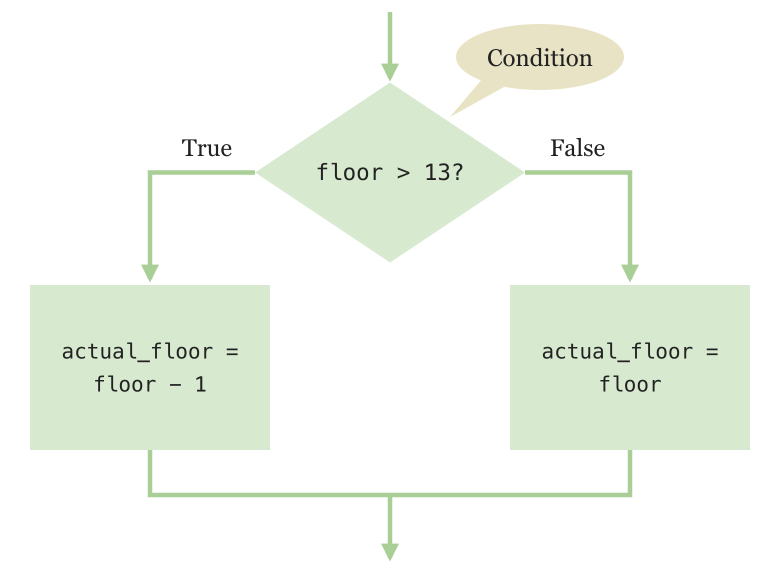
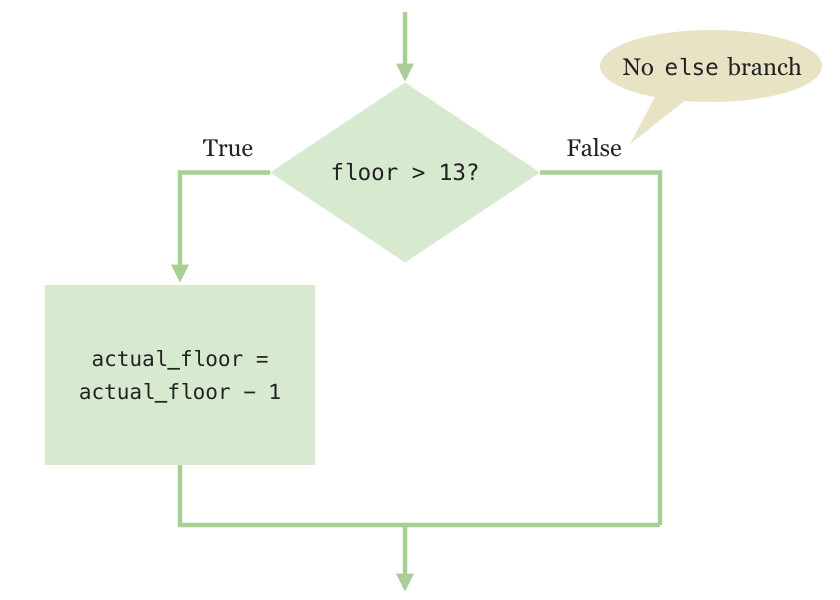
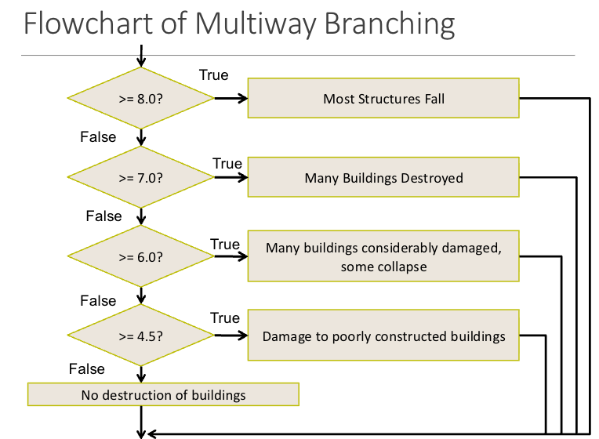
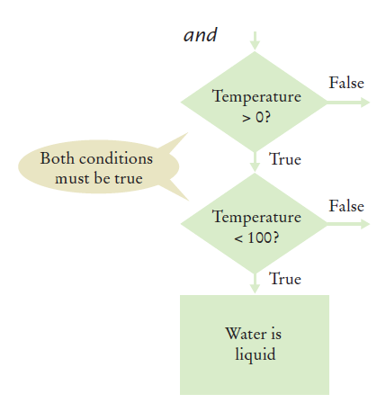
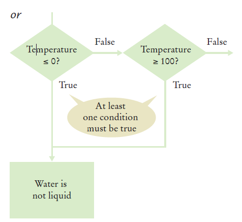

# Chapter Two: Decisions and Relational Operators

The first big step beyond straight-line code: **decisions** — programs that do different things depending on the data. You will program simple and complex decisions, and apply them to checking user input.

[← Back to Course Index](../table-of-contents.md)

---

## Chapter Goals

In this chapter you will **learn**:

- To implement decisions using the **`if`** statement
- To compare integers, floating-point numbers, and strings using **relational operators**
- To write **nested `if`** statements, and to use **`elif`** for multiple alternatives
- To use the **Boolean** data type (`True`/`False`) and **truthy** / **falsy** values in conditions
- To combine conditions using **`and`**, **`or`**, and **`not`**, and understand their **precedence**
- To use **`pass`** as a placeholder in a statement block
- To analyze strings using the **`in`** operator and string methods
- To **validate** user input and handle invalid data

---

## Chapter Contents

- **2.1 The `if` Statement** — Two-way branches, compound statements, statement blocks, and `pass`
- **2.2 Relational Operators** — Comparing numbers, floating-point values, and strings
- **2.3 Nested Branches** — An `if` inside another `if`
- **2.4 Multiple Alternatives** — `if` / `elif` / `else` chains
- **2.5 Boolean Variables and Operators** — `and` / `or` / `not`, precedence, short-circuit evaluation, De Morgan's law, truthy and falsy values
- **2.6 Analyzing Strings** — `in`, `startswith()`, `endswith()`, and character tests
- **2.7 Application: Input Validation** — Rejecting bad input before using it

---

## 2.1 The `if` Statement

### What is an `if` Statement?

A computer program often needs to make decisions based on input or circumstances. The `if` statement lets a program carry out different actions depending on the data.

**Example:** Buildings often "skip" the 13th floor, and elevators should too. The labeled floor 14 is really physical floor 13, so any requested floor **above 13** is adjusted by subtracting 1.

```python
if floor > 13:
    actual_floor = floor - 1
else:
    actual_floor = floor
```

The `if` statement uses two keywords, `if` and `else`. Exactly **one** of the two branches runs:

- **True (`if`) branch** — runs when the condition is true
- **False (`else`) branch** — runs when the condition is false



### Flowchart with Only a True Branch

An `if` statement may not need an `else` branch. Sometimes you only want to run code when a condition is true, and do nothing otherwise.



```python
actual_floor = floor

if floor > 13:
    actual_floor = actual_floor - 1
```

### Syntax 2.1: The `if` Statement

```python
if condition:          # the header ends with a colon
    statements         # run only when condition is True

if condition:
    statements_1       # run when condition is True
else:
    statements_2       # run when condition is False
```

- The condition is usually a comparison using a relational operator (see §2.2).
- `if` and `else` line up in the same column; the statements under each are indented.
- Leave out the `else` branch if there is nothing to do.

### elevatorsim.py Example

```python
##
#  This program simulates an elevator panel that skips the 13th floor.
#

# Obtain the floor number from the user as an integer.
floor = int(input("Floor: "))

# Adjust floor if necessary.
if floor > 13:
    actual_floor = floor - 1
else:
    actual_floor = floor

# Print the result.
print("The elevator will travel to the actual floor", actual_floor)
```

**A sample run:**

```
Floor: 20
The elevator will travel to the actual floor 19
```

**Instructions:**

1. Open the file: `elevatorsim.py`
2. Run the program with a value less than 13 — what is the result?
3. Run it again with a value greater than 13 — what is the result?
4. What happens if you enter 13?

### Compound Statements and Statement Blocks

The `if` statement is a **compound statement**: it spans several lines and consists of a **header** followed by a **statement block**.

- The header ends with a colon `:`
- The statement block is one or more statements, all indented to the same column (4 spaces is standard)
- The block ends at the first line that is indented less than the block
- Blocks can be nested inside other blocks — you will see this in §2.3

In an `if` statement, the block holds the statements that run when the condition is true and are skipped when it is false. The indentation is not just for looks — Python uses it to decide which statements belong to the `if`.

**Let PyCharm do the indenting for you.** When you press Enter after a line ending in `:`, PyCharm indents the next line automatically. To end the block, press Backspace to move back out one level.

### The `pass` Statement

Every statement block must contain **at least one statement**. If you do not have code to run yet, use **`pass`** — it does nothing, but it satisfies Python's syntax:

```python
if floor == 13:
    pass   # placeholder: handle invalid floor later
else:
    print("We will move to the floor", floor)
```

You will see `pass` again with loops and functions when a block is required but empty for now.

### ⚠️ A Common Error: Avoid Duplication

If the same code appears in both branches, move it out of the `if` statement.

```python
# ❌ Bad - the print is duplicated in both branches
if floor > 13:
    actual_floor = floor - 1
    print("Actual floor:", actual_floor)
else:
    actual_floor = floor
    print("Actual floor:", actual_floor)

# ✅ Good - common code moved after the if
if floor > 13:
    actual_floor = floor - 1
else:
    actual_floor = floor
print("Actual floor:", actual_floor)
```

### The Conditional Operator (Ternary Operator)

A shortcut you may see in existing code. **It is not used in this course** — it packs an entire `if`/`else` into one line, which makes it harder for beginners to read.

```python
actual_floor = floor - 1 if floor > 13 else floor
```

This means the same as the four-line `if`/`else` at the start of this section. Use the regular `if`/`else` form.

## 2.2 Relational Operators

Every `if` statement has a **condition** that usually compares two values with a **relational operator**. Each comparison produces `True` or `False`.

| Operator | Meaning               | Example  | Value   |
| -------- | --------------------- | -------- | ------- |
| `>`      | greater than          | `3 > 4`  | `False` |
| `>=`     | greater than or equal | `4 >= 4` | `True`  |
| `<`      | less than             | `3 < 4`  | `True`  |
| `<=`     | less than or equal    | `3 <= 4` | `True`  |
| `==`     | equal                 | `3 == 4` | `False` |
| `!=`     | not equal             | `3 != 4` | `True`  |

### Assignment vs. Equality Testing

- **Assignment (`=`)** stores a value in a variable.
- **Equality testing (`==`)** asks whether two values are the same.

```python
floor = 13          # assignment: store 13 in floor

if floor == 13:     # equality test: is floor equal to 13?
    print("Error: There is no thirteenth floor.")
```

> **Common Error:** Writing `=` instead of `==` in a condition. Python refuses to run the program:
>
> ```
>     if floor = 13:
>        ^^^^^^^^^^
> SyntaxError: invalid syntax. Maybe you meant '==' or ':=' instead of '='?
> ```

### Comparing Floating-Point Numbers

Floating-point arithmetic is not always exact, so `==` can give a surprising answer:

```python
x = 0.1 + 0.2
print(x)           # 0.30000000000000004
print(x == 0.3)    # False
```

Instead of testing floats for exact equality, test whether they are **close enough**:

```python
if abs(x - 0.3) < 0.000001:
    print("Close enough")
```

### Comparing Strings

`==` and `!=` work on strings too:

```python
if name1 == name2:
    print("The strings are identical")
else:
    print("The strings are different")
```

**For two strings to be equal**, they must:

- Be the **same length**
- Contain the **same sequence of characters** (case-sensitive)


**If any character is different**, the two strings are not equal:


### Lexicographical Order

The ordering operators (`<`, `<=`, `>`, `>=`) compare strings in **dictionary-like order**, one character at a time from the left:

```python
print("apple" < "banana")   # True  - "a" comes before "b"
print("Zebra" < "apple")    # True  - uppercase comes before lowercase
print("150" < "2")          # True  - "1" comes before "2"
```

**Important Notes:**

- All **UPPERCASE** letters come before lowercase (e.g., `"Z" < "a"`)
- **Space** comes before all other printable characters
- **Digits (0-9)** come before all letters
- Strings of digits are compared as text, not as numbers — that is why `"150" < "2"`

### Steps for Implementing an `if` Statement

**Problem:** A store gives 8% off purchases under $128, and 16% off purchases of $128 or more.

1. **Decide on the condition:** `original price < 128`
2. **Write pseudocode for each branch:**
   - True: `discounted price = 0.92 × original price`
   - False: `discounted price = 0.84 × original price`
3. **Double-check the relational operator.** Does $128 exactly get 8% or 16%? Test values **below, at, and above** the boundary: 127, 128, 129.
4. **Remove duplication.** Both branches multiply by a rate, so the `if` only needs to choose the rate.
5. **Hand-check both branches:** 0.92 × 100 = 92, and 0.84 × 200 = 168.
6. **Write the code in Python:**

```python
##
#  Compute the discount for a given purchase.
#

# Obtain the original price.
original_price = float(input("Original price before discount: "))

# Determine the discount rate.
if original_price < 128:
    discount_rate = 0.92
else:
    discount_rate = 0.84

# Compute and print the discount.
discounted_price = discount_rate * original_price
print(f"Discounted price: {discounted_price:.2f}")
```

**A sample run:**

```
Original price before discount: 200
Discounted price: 168.00
```

**Instructions:**

1. Open the file: `sale.py`
2. Run the program several times using different values:
   - Values less than 128
   - Values greater than 128
   - 128 exactly
3. Do the results match your hand calculations?

## 2.3 Nested Branches

You can **nest** an `if` inside either branch of another `if` statement.

**Problem:** A movie theater charges students $8 regardless of age. Non-students pay $6 if they are under 12, and $12 otherwise.

**Three possible outcomes:**

- Student → $8
- Non-student and age < 12 → $6
- Non-student and age >= 12 → $12

### Flowchart for the Movie Ticket Example

```
Ask if student
    ↓
Student? → Yes → Price = $8
    ↓
   No
    ↓
Ask for age
    ↓
Age < 12? → Yes → Price = $6
    ↓
   No
    ↓
Price = $12
```

### movie_ticket.py Example

```python
##
#  This program works out a movie ticket price from student status and age.
#

answer = input("Are you a student? (yes/no): ")

if answer == "yes":
    price = 8
else:
    # Only non-students are asked for their age.
    age = int(input("Enter your age: "))
    if age < 12:
        price = 6
    else:
        price = 12

print(f"Your ticket costs ${price}")
```

- The **outer `if`** checks whether the customer is a student.
- The **inner `if`** (nested in the `else` branch) checks the age — students never reach it, so they are never asked.
- Together they create **three possible paths** through the program.

**Instructions:**

1. Run the program with different inputs:
   - `yes` (should show $8)
   - `no`, then `8` (should show $6)
   - `no`, then `15` (should show $12)
2. Trace through the code to see which branch runs for each input.

## 2.4 Multiple Alternatives

### What if You Have More Than Two Branches?

Sometimes you need more than two alternatives. Count the branches in this earthquake example:

- **8.0 or greater** — Most structures fall
- **7.0 to 7.99** — Many buildings destroyed
- **6.0 to 6.99** — Many buildings considerably damaged, some collapse
- **4.5 to 5.99** — Damage to poorly constructed buildings
- **Less than 4.5** — No destruction of buildings

### Flowchart of Multiway Branching



### The `elif` Statement

`elif` is short for **"else, if..."**

- The conditions are tested from top to bottom.
- As soon as one condition is true, its block runs and **no other tests are attempted**.
- If none of the conditions is true, the final `else` block runs.

### Earthquake Example

```python
##
#  This program prints a description of an earthquake, given the Richter scale
#  magnitude.
#

# Obtain the user input.
richter = float(input("Enter a magnitude on the Richter scale: "))

# Print the description.
if richter >= 8.0:
    print("Most structures fall")
elif richter >= 7.0:
    print("Many buildings destroyed")
elif richter >= 6.0:
    print("Many buildings considerably damaged, some collapse")
elif richter >= 4.5:
    print("Damage to poorly constructed buildings")
else:
    print("No destruction of buildings")
```

**Instructions:**

1. Open the file: `earthquake.py`
2. Run the program with 3.0, 5.0, 6.5, 7.5, and 9.0

> **Order matters:** test the **most restrictive** condition first. If the chain started with `richter >= 4.5`, a magnitude 8.5 earthquake would print "Damage to poorly constructed buildings" and stop — the stronger descriptions would never be reached.

### ⚠️ What is Wrong With This Code?

```python
if richter >= 8.0:
    print("Most structures fall")
if richter >= 7.0:
    print("Many buildings destroyed")
if richter >= 6.0:
    print("Many buildings considerably damaged, some collapse")
if richter >= 4.5:
    print("Damage to poorly constructed buildings")
```

**Problem:** If `richter` is 8.5, **all four messages print**, because each `if` is tested independently. Use `elif` so that only one branch runs.

## 2.5 Boolean Variables and Operators

### Boolean Variables

A comparison produces a **Boolean** value — `True` or `False` — and you can store it in a variable, just like a number or a string:

```python
floor = 20
above_13 = floor > 13
print(above_13)    # True
```

A Boolean variable is often called a **flag** because it can be either up (`True`) or down (`False`).

**Boolean operators** combine or invert conditions: `and`, `or`, and `not`.

### Combined Conditions: `and`

**Both sides of the `and` must be true** for the result to be true. This is often used for **range checking** — is a value between two others?

```python
if temp > 0 and temp < 100:
    print("Liquid")
```



### Combined Conditions: `or`

**If either side is true, the result is true.** This checks whether a value is **outside** a range:

```python
if temp <= 0 or temp >= 100:
    print("Not liquid")
```



### The `not` Operator

`not` flips a Boolean value: `not True` is `False`, and `not False` is `True`.

```python
frozen = temp <= 0

if not frozen:
    print("Not frozen")
```

A negated comparison can usually be written more simply without `not`:

- `not (temp <= 0)` is the same as `temp > 0`
- `not (a == b)` is the same as `a != b`

Prefer the simpler form — it is easier to read.

### Boolean Operator Examples

| Expression        | Value   |
| ----------------- | ------- |
| `True and True`   | `True`  |
| `True and False`  | `False` |
| `False and True`  | `False` |
| `False and False` | `False` |
| `True or True`    | `True`  |
| `True or False`   | `True`  |
| `False or True`   | `True`  |
| `False or False`  | `False` |
| `not True`        | `False` |
| `not False`       | `True`  |

### Boolean Operator Precedence

When one condition mixes `not`, `and`, and `or`, Python applies them in this order (highest to lowest):

| Order | Operator |
| ----- | -------- |
| 1     | `not`    |
| 2     | `and`    |
| 3     | `or`     |

**Example:** test whether `x` and `y` have the **same sign** (both positive or both negative):

```python
if (x > 0 and y > 0) or (x < 0 and y < 0):
    print("The numbers have the same sign")
```

The parentheses are not required — `and` is evaluated before `or` anyway — but they make the intent obvious. When a condition is hard to read, **add parentheses** even if they are not required.

### Comparison Example

```python
##
#  This program demonstrates comparisons of numbers, using Boolean expressions.
#

x = float(input("Enter a number (such as 3.5 or 4.5): "))
y = float(input("Enter a second number: "))

if x == y:
    print("They are the same.")
else:
    if x > y:
        print("The first number is larger")
    else:
        print("The first number is smaller")

    if abs(x - y) < 0.01:
        print("The numbers are close together")

    if (x > 0 and y > 0) or (x < 0 and y < 0):
        print("The numbers have the same sign")
    else:
        print("The numbers have different signs")
```

**Instructions:**

1. Open the file: `compare2.py`
2. Run the program with several inputs: two numbers with the same sign, two with opposite signs, and two that are almost equal (such as 3.5 and 3.501)

### ⚠️ Common Error: Confusing `and` and `or`

It is a surprisingly common error to confuse `and` and `or`:

- A value lies **between** 0 and 100 if it is greater than 0 **and** less than 100
- It lies **outside** that range if it is at most 0 **or** at least 100

```python
# ❌ Never true - no temperature is both <= 0 and >= 100
if temp <= 0 and temp >= 100:
    print("Not liquid")
```

There is no golden rule; you just have to think carefully about what you are checking.

### Short-Circuit Evaluation

Combined conditions are evaluated **from left to right**, and Python stops as soon as it knows the answer:

- **`and`:** if the left side is `False`, the whole expression must be `False`, so the right side is never checked.
- **`or`:** if the left side is `True`, the whole expression must be `True`, so the right side is never checked.

For example, with `temp = -5`, Python evaluates `temp > 0` in `temp > 0 and temp < 100`, gets `False`, and skips `temp < 100`.

### De Morgan's Law

**De Morgan's law** tells you how to simplify a `not` in front of an `and` or `or`:

- `not (A and B)` is the same as `not A or not B`
- `not (A or B)` is the same as `not A and not B`

**Example:** "not liquid" is the opposite of "liquid", so you could write it with `not`:

```python
if not (temp > 0 and temp < 100):
    print("Not liquid")
```

Apply De Morgan's law: the `and` becomes `or`, and each part is negated — `not (temp > 0)` is `temp <= 0`, and `not (temp < 100)` is `temp >= 100`:

```python
if temp <= 0 or temp >= 100:
    print("Not liquid")
```

This is exactly the `or` condition from earlier — and it is easier to read.

### Truthy and Falsy Values

An `if` condition does not have to be a comparison. Python treats any value as true or false in a condition:

- **Falsy** — treated like `False`: `False`, `0`, `0.0`, and `""` (the empty string)
- **Truthy** — treated like `True`: almost everything else, including non-zero numbers and non-empty strings

You can check how Python classifies a value with `bool()`:

```python
print(bool(0))       # False
print(bool(0.0))     # False
print(bool(""))      # False
print(bool(42))      # True
print(bool("hi"))    # True
```

**Checking that a string is not empty:**

```python
name = input("Name: ")

# Long form
if name != "":
    print("Hello,", name)

# Idiomatic Python - same idea
if name:
    print("Hello,", name)
```

**Caution:** `if score:` means "score is not zero". Be careful not to reject `0` when zero is valid input.

## 2.6 Analyzing Strings

### The `in` Operator

Sometimes you need to know whether a string contains a given **substring** — an exact match of another string somewhere inside it.

```python
name = "John Wayne"

if "Way" in name:
    print("Found 'Way' in the name")
```

The expression `"Way" in name` is `True` because the substring `"Way"` occurs within the string stored in `name`.

The `not in` operator is the opposite of `in`:

```python
if "Smith" not in name:
    print("'Smith' is not in the name")
```

### Substring: Suffixes

Suppose you need to check that a file name has the correct extension:

```python
filename = "index.html"

if filename.endswith(".html"):
    print("This is an HTML file.")
```

`endswith()` returns `True` if the string ends with the given substring and `False` otherwise.

### Operations for Testing Substrings

| Operator / method   | Description                                                  |
| ------------------- | ------------------------------------------------------------ |
| `sub in s`          | `True` if `sub` appears anywhere in `s`                      |
| `sub not in s`      | `True` if `sub` does not appear in `s`                       |
| `s.startswith(sub)` | `True` if `s` begins with `sub`                              |
| `s.endswith(sub)`   | `True` if `s` ends with `sub`                                |
| `s.find(sub)`       | Index of the first occurrence of `sub`, or `-1` if not found |
| `s.count(sub)`      | Number of non-overlapping occurrences of `sub`               |

### Methods: Testing String Characteristics

| Method        | Description                                    | Example           | Result |
| ------------- | ---------------------------------------------- | ----------------- | ------ |
| `s.isalpha()` | `True` if every character is a letter          | `"abc".isalpha()` | `True` |
| `s.isdigit()` | `True` if every character is a digit           | `"123".isdigit()` | `True` |
| `s.isalnum()` | `True` if every character is a letter or digit | `"a1".isalnum()`  | `True` |
| `s.islower()` | `True` if all cased letters are lowercase      | `"hi".islower()`  | `True` |
| `s.isupper()` | `True` if all cased letters are uppercase      | `"HI".isupper()`  | `True` |

See [Chapter 1, Section 1.7](../chapter01%20-%20Introduction%20&%20Programming%20with%20Numbers%20and%20Strings/chapter01.md#some-useful-string-methods) for other string methods such as `upper()`, `lower()`, and `replace()`.

### Substring Example

```python
##
#  This program demonstrates the various string methods that test substrings.
#

# Obtain a string and substring from the user.
text = input("Enter a string: ")
substring = input("Enter a substring: ")

if substring in text:
    print("The string does contain the substring.")

    how_many = text.count(substring)
    print("   It contains", how_many, "instance(s)")

    where = text.find(substring)
    print("   The first occurrence starts at position", where)

    if text.startswith(substring):
        print("   The string starts with the substring.")
    else:
        print("   The string does not start with the substring.")

    if text.endswith(substring):
        print("   The string ends with the substring.")
    else:
        print("   The string does not end with the substring.")

else:
    print("The string does not contain the substring.")
```

**Instructions:**

1. Open the file: `substrings.py`
2. Run the program with several strings and substrings — try one that appears at the start, one at the end, one that appears more than once, and one that does not appear at all

## 2.7 Application: Input Validation

### Why Input Validation?

Accepting user input is dangerous — users can enter invalid data.

Consider the elevator program again, and assume the panel has buttons labeled 1 through 20 (but not 13).

### Illegal Inputs

The following are illegal inputs:

1. **The number 13** (there is no 13th floor)

   ```python
   if floor == 13:
       print("Error: There is no thirteenth floor.")
   ```

2. **Zero, a negative number, or a number larger than 20**

   ```python
   if floor <= 0 or floor > 20:
       print("Error: The floor must be between 1 and 20.")
   ```

3. **An input that is not a whole number** (e.g., `five` instead of `5`) — `int()` cannot convert it, and the program stops with an error:

   ```
   ValueError: invalid literal for int() with base 10: 'five'
   ```

   Handling this case needs Python's exception mechanism, covered in Chapter 6.

### elevatorsim2.py Example

```python
##
#  This program simulates an elevator panel that skips the 13th floor,
#  checking for input errors.
#

# Obtain the floor number from the user as an integer.
floor = int(input("Floor: "))

# Make sure the user input is valid.
if floor == 13:
    print("Error: There is no thirteenth floor.")
elif floor <= 0 or floor > 20:
    print("Error: The floor must be between 1 and 20.")
else:
    # Now we know that the input is valid.
    actual_floor = floor
    if floor > 13:
        actual_floor = floor - 1

    print("The elevator will travel to the actual floor", actual_floor)
```

**Instructions:**

1. Open the file: `elevatorsim2.py`
2. Test the program with a range of inputs:
   - Valid inputs: 1, 12, 14, 20
   - Invalid inputs: -1, 0, 13, 21
   - Non-numeric input: `five` — which error do you get?

---

## Key Takeaways

1. **Decision-making** is fundamental to programming — use `if`, `elif`, and `else` to control program flow.
2. **Relational operators** compare values and produce `True` or `False`. Use `==` (not `=`) to test equality, and compare floats with a tolerance rather than `==`.
3. **Nested `if` statements** enable decisions that depend on earlier decisions.
4. In an **`elif` chain**, only the first true branch runs — test the most restrictive condition first.
5. **Boolean operators** (`and`, `or`, `not`) combine conditions; precedence is `not`, then `and`, then `or` — use parentheses when mixing them.
6. **Short-circuit evaluation** — Python stops evaluating a Boolean expression as soon as the result is determined.
7. **Truthy and falsy** values let you write conditions like `if name:` instead of `if name != ""` — watch out for `0` and empty strings.
8. **`pass`** is a do-nothing placeholder when a block must exist but has no code yet.
9. **String analysis** using the `in` operator and string methods helps validate and process text data.
10. **Input validation** is essential — always check user input before using it in your program.

---

*End of Chapter Two*

[← Back to Course Index](../table-of-contents.md)
