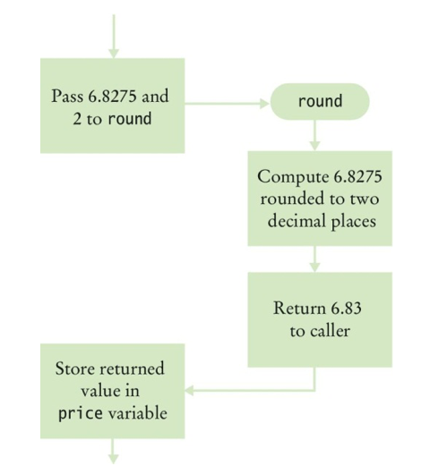
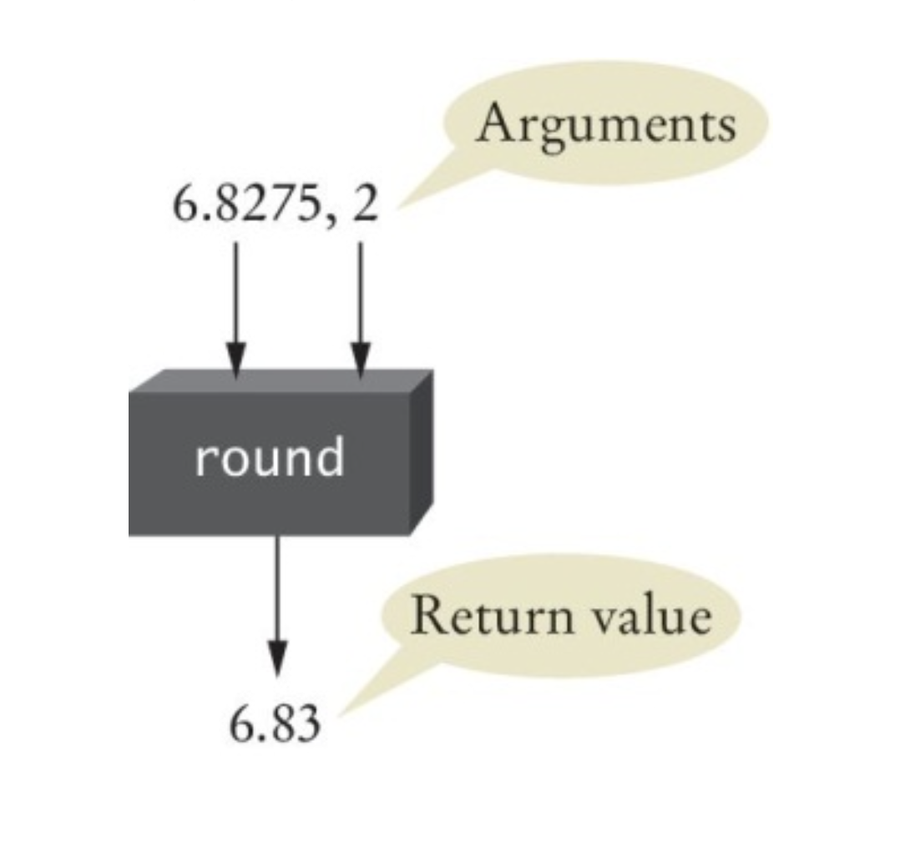

# Chapter Four: Functions

So far every program has been one long list of statements. As programs grow, that stops working: the same calculation shows up in three places, and nobody can tell at a glance what a fifty-line block is for. **Functions** fix this. In this chapter you will learn how to design and implement your own functions, how values get into a function and back out, and which parts of a program can see which variables.

[← Back to Course Index](../table-of-contents.md)

---

## Chapter Goals

In this chapter you will **learn**:

- To **implement** functions
- To become familiar with the concept of **parameter passing**
- To design functions as **black boxes** with clear inputs and outputs
- To use **default parameter values** and **keyword arguments**
- To **return** one value, several values, or no value at all
- To be able to determine the **scope** of a variable

---

## Chapter Contents

- **4.1 Functions as Black Boxes** — Calling a function, arguments, and return values
- **4.2 Implementing and Testing Functions** — `def`, the `main` function, and the order of definitions
- **4.3 Parameter Passing** — Arguments and parameters, default values, and keyword arguments
- **4.4 Return Values** — Returning one value or several, and making sure every path returns
- **4.5 Functions Without Return Values** — Functions that do something instead of computing something
- **4.6 Variable Scope** — Local and global variables

---

## 4.1 Functions as Black Boxes

A **function** is a sequence of instructions with a name. You have been using functions since Chapter 1. For example, the `round` function (§1.5) contains instructions to round a floating-point value to a specified number of decimal places.

### Calling Functions

You **call** a function in order to execute its instructions. For example, by using the expression `round(6.8275, 2)`, your program calls the `round` function and asks it to round 6.8275 to two decimal digits:

```python
price = round(6.8275, 2)  # Sets price to 6.83
```

When the function finishes, it **returns** its result back to the place where it was called, and your program resumes execution.



### Function Arguments

When you call a function, you pass it *inputs* — the values it needs to do its job. In the call `round(6.8275, 2)`, the values `6.8275` and `2` are the **arguments** of the function call. Arguments are not necessarily input from a human user; they are simply the values for which we want the function to compute a result. Functions can receive multiple arguments, or they may have no arguments at all.

### Function Return Values

The *output* that a function computes is called its **return value**. A function sends back a single result to the point in your program where the function was called. (In §4.4 you will see that this one result can bundle several values together.) For example:

```python
price = round(6.8275, 2)
```

When `round` returns, its result is stored in the variable `price`.

> **Note:** Do not confuse *returning* a value with *printing* output. `return` sends a value back to the caller, which can store it or use it in a calculation. `print()` only displays text to the user.

### The Black Box Analogy

Think of a thermostat: you set a desired temperature and it turns the heater or A/C on as needed. You don't have to know how it measures the current temperature or what signals it sends — you just give it what it needs and get the result. **Use functions the same way:** treat them as black boxes. Pass in what the function needs (its arguments), and receive the answer (its return value).

### The `round` Function as a Black Box

When you call `round(6.8275, 2)`, you pass the necessary arguments and get back the result (`6.83`). As a user of the function, you don't need to know how it is implemented; you only need to know its **specification**: if you provide arguments `x` and `n`, the function returns `x` rounded to `n` decimal digits.



### Designing Your Own Functions

When you design your own functions, make them behave like black boxes: clear inputs, clear output, and no need for the caller to know the internals. Even if you are the only person on the project, this habit keeps the program easier to understand and maintain.

---

## 4.2 Implementing and Testing Functions

Suppose we want a function that computes the volume of a cube. To define it we need to decide two things: what does it need (one number, the side length), and what does it return (the volume)?

### Naming Functions

As with variables (§1.4), Python style uses **`snake_case`** for function names: lowercase words separated by underscores — `cube_volume`, not `cubeVolume`. Use the same convention for parameter and local variable names — `side_length`, not `sideLength`.

When writing the function:

1. **Pick a name** for the function (`cube_volume`).
2. **Declare a variable** for each value the function receives (`side_length`). These are called **parameter variables**.
3. **Put this together** with the `def` keyword to form the first line — the **header** of the function:

   ```python
   def cube_volume(side_length):
   ```

4. **Write the body** — the indented statements that compute the result and `return` it.

### Syntax 4.1: Function Definition

```python
def function_name(parameter_name1, parameter_name2, ...):   # the header ends with a colon
    statements                                              # the body, indented
```

For example:

```python
def cube_volume(side_length):     # header: name of the function, then the parameter variable
    volume = side_length ** 3     # body: runs only when the function is called
    return volume                 # return exits the function and sends back the result
```

- The **header** starts with `def`, then the function name, then the parameter variables in parentheses, then a colon.
- The **body** is indented, like the body of an `if` or a loop. It runs only when the function is **called** — defining the function does not run it.
- The **`return` statement** exits the function and sends the result back to the caller.

### Testing a Function

If you run a program that only defines a function and does not call it, nothing visible happens — the function is never executed. To test a function, your program should contain both the function definition and statements that call the function and print (or use) the result.

```python
def cube_volume(side_length):
    volume = side_length ** 3
    return volume

result1 = cube_volume(2)
result2 = cube_volume(10)
print(f"A cube with side length 2 has volume {result1}")
print(f"A cube with side length 10 has volume {result2}")
```

- The first block is the **function definition** (implementing the function).
- The last four lines **call** the function and print the results (testing it).

### Programming Tip: Function Comments

Whenever you write a function, document what it does, what its parameters mean, and what it returns. Comments are for human readers, not for Python — they make the code easier to understand and maintain.

In Python, a function is documented with a **docstring**: a string in triple quotes placed as the first line of the body.

```python
def cube_volume(side_length):
    """Compute the volume of a cube.

    side_length: the length of a side of the cube
    Returns the volume of the cube.
    """
    volume = side_length ** 3
    return volume
```

A docstring is better than a `#` comment above the function because Python keeps it with the function: PyCharm shows it when you hover over a call, and `help(cube_volume)` prints it.

### The `main` Function

When you structure a program with functions, it is good practice to put the main logic inside a function too, and treat that function as the **starting point** of the program. Any legal name is allowed; we use `main` because it is the conventional name in many languages. The program must have at least one statement **outside** all function definitions that calls `main()`, so that execution actually starts.

### Syntax 4.2: The `main` Function

```python
def main():                                  # by convention, main is the starting point
    result = cube_volume(2)                  # cube_volume is defined below
    print(f"A cube with side length 2 has volume {result}")

def cube_volume(side_length):
    volume = side_length ** 3
    return volume

main()                                       # outside any function definition
```

### cubes.py Example

```python
##
#  This program computes the volumes of two cubes.
#

def main():
    result1 = cube_volume(2)
    result2 = cube_volume(10)
    print(f"A cube with side length 2 has volume {result1}")
    print(f"A cube with side length 10 has volume {result2}")

def cube_volume(side_length):
    """Compute the volume of a cube.

    side_length: the length of a side of the cube
    Returns the volume of the cube.
    """
    volume = side_length ** 3
    return volume

# Start the program.
main()
```

**Program run:**

```
A cube with side length 2 has volume 8
A cube with side length 10 has volume 1000
```

### Using Functions: Order Matters

In Python, a function must be **defined before it is called**. For example, the following program fails:

```python
print(cube_volume(10))

def cube_volume(side_length):
    volume = side_length ** 3
    return volume
```

```
Traceback (most recent call last):
  File "cubes.py", line 1, in <module>
    print(cube_volume(10))
          ^^^^^^^^^^^
NameError: name 'cube_volume' is not defined
```

Python runs the file from top to bottom. When it reaches line 1, it has not yet seen the `def` for `cube_volume`, so the name does not exist.

If the call is *inside* another function, such as `main`, the called function can be defined later in the file. The call does not happen until `main()` runs — and by then Python has already read every `def` in the file. So the following is valid:

```python
def main():
    result = cube_volume(2)
    print(f"A cube with side length 2 has volume {result}")

def cube_volume(side_length):
    volume = side_length ** 3
    return volume

main()
```

This is one reason to use a `main` function: you can put the big picture at the top of the file and the helper functions below it, and the call to `main()` at the very end.

---

## 4.3 Parameter Passing

When you **call** a function, you pass **arguments**. The function receives those values in its **parameters**. Parameter passing is how the values get from the caller into the function.

### Arguments and Parameters

- **Argument** — The value you pass in the function call, as in `cube_volume(2)` or `cube_volume(side)`. It can be a literal like `2`, the value of a variable, or any expression.
- **Parameter** — The variable declared in the function header, like `side_length` in `def cube_volume(side_length):`. It is initialized with the argument value when the function is called, and used like any other variable inside the function.

So in `result1 = cube_volume(2)`, the argument is `2`. Inside `cube_volume`, the parameter `side_length` is set to `2` for that call.

### What Happens When You Call a Function

Here are the steps when `result1 = cube_volume(2)` is executed:

| Step | What happens                                         | `side_length` | `volume` | `result1`   |
| ---- | ---------------------------------------------------- | ------------- | -------- | ----------- |
| 1    | The argument `2` is evaluated                        | —             | —        | —           |
| 2    | `cube_volume` is called; `side_length` is set to `2` | `2`           | —        | —           |
| 3    | The body runs: `volume = side_length ** 3`           | `2`           | `8`      | —           |
| 4    | `return volume` sends `8` back to the caller         | —             | —        | —           |
| 5    | The returned value is assigned to `result1`          | —             | —        | `8`         |

After step 4 the function has finished, and its variables `side_length` and `volume` no longer exist. Only the returned value survives.

Assigning a new value to a parameter inside the function changes only the parameter — the caller's variable keeps its value:

```python
def total_cents(dollars, cents):
    cents = dollars * 100 + cents
    return cents

coins = 50
print(total_cents(3, coins))   # 350
print(coins)                   # 50 — unchanged
```

### ⚠️ Common Error: Modifying Parameter Variables

Even though it does not affect the caller, **assigning to a parameter inside the function is confusing**. Readers expect parameters to hold the inputs the function was given. Avoid modifying parameter variables; use a separate local variable instead.

**❌ Confusing (modifies the parameter):**

```python
def total_cents(dollars, cents):
    cents = dollars * 100 + cents   # Modifies parameter variable
    return cents
```

**✅ Clear (uses a separate variable):**

```python
def total_cents(dollars, cents):
    result = dollars * 100 + cents
    return result
```

### Default Parameter Values

A parameter can have a **default value**. If the caller does not supply an argument for that parameter, Python uses the default instead.

```python
def greet(name="World"):
    print(f"Hello, {name}!")

greet()           # Hello, World!
greet("Alice")    # Hello, Alice!
```

In `def greet(name="World"):`, the parameter `name` defaults to `"World"`. A call with no arguments uses that default; a call with one argument replaces it.

Parameters **with** defaults must come **after** parameters **without** defaults:

```python
def power(base, exponent=2):
    return base ** exponent

print(power(5))      # 25 — exponent defaults to 2
print(power(5, 3))   # 125
```

### Keyword Arguments

When you **call** a function, you can match arguments to parameters **by name** using the form `name=value`. These are **keyword arguments**. They make calls easier to read, especially when a function has several parameters.

So far you have used **positional arguments**, matched to parameters by their order:

```python
round(6.8275, 2)                  # positional: first → number, second → ndigits
```

The same call with keyword arguments:

```python
round(number=6.8275, ndigits=2)   # keyword arguments
```

Both forms produce `6.83`. Keyword arguments are useful when you want to be explicit about which value goes where, or when you want to skip over parameters that have defaults.

You can combine positional and keyword arguments in one call:

```python
greet(name="Bob")              # keyword only
power(5, exponent=3)           # positional first, then keyword
round(6.8275, ndigits=2)       # positional first, then keyword
```

**Rule:** Positional arguments must come **before** keyword arguments in a call. This is invalid:

```python
greet(name="Bob", "Alice")
```

```
    greet(name="Bob", "Alice")
                             ^
SyntaxError: positional argument follows keyword argument
```

---

## 4.4 Return Values

Functions can **return** a value to the caller. You use a `return` statement to send that value back. A `return` statement does two things: it immediately **terminates** the function, and it **passes** the return value back to the place where the function was called. The return value can be a literal, a variable, or any expression (such as a calculation).

```python
def cube_volume(side_length):
    volume = side_length ** 3
    return volume
```

### Returning Multiple Values

A function can return **more than one value** by listing them, separated by commas, in a single `return` statement:

```python
def min_max(first, second):
    if first <= second:
        return first, second
    else:
        return second, first
```

Python groups the returned values together and sends them back as **one combined result**. You will learn about **tuples** — the data type Python uses for this — in Chapter 5 (§5.5). For now, focus on **unpacking**: assigning each returned value to its own variable.

```python
low, high = min_max(10, 3)
print(low)    # 3
print(high)   # 10
```

The number of variables on the left must match the number of values returned. With too few or too many, Python stops with an error such as:

```
ValueError: too many values to unpack (expected 2)
```

You can also store the combined result in one variable:

```python
result = min_max(10, 3)
print(result)   # (3, 10) — the parentheses show it is one grouped value
```

Returning multiple values is useful when a function computes several related results. Here is a function that finds both the minimum and the maximum of three grades, using the decisions from Chapter 2 and the same idea as the maximum and minimum algorithms in §3.4:

```python
def min_max_grade(grade1, grade2, grade3):
    minimum = grade1
    maximum = grade1
    if grade2 < minimum:
        minimum = grade2
    if grade2 > maximum:
        maximum = grade2
    if grade3 < minimum:
        minimum = grade3
    if grade3 > maximum:
        maximum = grade3
    return minimum, maximum

low, high = min_max_grade(88, 55, 72)
print(f"Min: {low}, Max: {high}")   # Min: 55, Max: 88
```

### Multiple `return` Statements

A function can have more than one `return` statement — for example, one in each branch of an `if`:

```python
def cube_volume(side_length):
    if side_length < 0:
        return 0
    return side_length ** 3
```

If `side_length` is negative, the first `return` runs and the function ends right there; the last line is never reached. Otherwise the condition is `False`, and execution falls through to the second `return`.

**Alternative:** Instead of multiple `return` statements, you can compute the result into a variable and have a single `return` at the end of the function:

```python
def cube_volume(side_length):
    if side_length >= 0:
        volume = side_length ** 3
    else:
        volume = 0
    return volume
```

### ⚠️ Common Error: Make Sure a `return` Catches All Cases

If some path through the function does not reach a `return` statement, the function still returns — Python returns the special value **`None`**. Python does not warn you about the missing `return`, so the bug only shows up later, when the caller tries to use the result.

```python
def cube_volume(side_length):
    if side_length >= 0:
        return side_length ** 3
    # ❌ No return statement if side_length < 0

print(cube_volume(-2))       # None
print(cube_volume(-2) + 1)   # Error
```

```
TypeError: unsupported operand type(s) for +: 'NoneType' and 'int'
```

Make sure **every** path that should produce a value has a `return`:

```python
def cube_volume(side_length):
    if side_length >= 0:
        return side_length ** 3
    else:
        return 0
```

### pyramids.py Example

In `pyramids.py`, the `main` function calls `pyramid_volume` with different arguments and prints each result next to the value we expect, so you can check that the function works.

```python
##
#  This program defines a function for calculating a pyramid's volume and
#  provides a unit test for the function.
#

def main():
    print("Volume:", pyramid_volume(9, 10))
    print("Expected: 300")
    print("Volume:", pyramid_volume(0, 10))
    print("Expected: 0")

def pyramid_volume(height, base_length):
    """Compute the volume of a pyramid whose base is a square.

    height: the height of the pyramid
    base_length: the length of one side of the pyramid's base
    Returns the volume of the pyramid as a float.
    """
    base_area = base_length * base_length
    return height * base_area / 3

# Start the program.
main()
```

**Program run:**

```
Volume: 300.0
Expected: 300
Volume: 0.0
Expected: 0
```

The results print as `300.0` and `0.0` because `/` always produces a `float` (§1.5). The values match what we expected.

---

## 4.5 Functions Without Return Values

A function does not have to return a value. If its job is to *do* something — such as print output — rather than compute a result, you can leave out the `return` statement. When the body finishes, the function returns `None`, which the caller simply ignores.

```python
def box_string(contents):
    length = len(contents)
    print("-" * (length + 2))
    print("!" + contents + "!")
    print("-" * (length + 2))

box_string("Hello")
```

**Program run:**

```
-------
!Hello!
-------
```

Notice that the call `box_string("Hello")` stands on its own as a statement. There is no result to store, so it is not on the right side of an `=`.

### Using `return` Without a Value

You can write `return` with no value. That **ends the function immediately** and returns `None` to the caller. This is useful for exiting early when there is nothing to do — for example, when the input is empty:

```python
def box_string(contents):
    length = len(contents)
    if length == 0:
        return  # Return immediately
    print("-" * (length + 2))
    print("!" + contents + "!")
    print("-" * (length + 2))
```

---

## 4.6 Variable Scope

The **scope** of a variable is the part of the program in which that variable is visible and can be used.

### Where Variables Can Be Defined

- **Inside a function** — These are **local variables** (parameter variables are local too). They exist only while the function runs, and they are not visible to other functions.
- **Outside all functions** — These are **global variables**. Any function can **read** a global variable, but a function can **assign** to one only if it declares `global name` first.

### Local Variables

Variables created inside one function are not visible to other functions. In the following example, `side_length` is local to `main`. Here `cube_volume` takes no parameters and tries to use `side_length` directly — but it has no access to `main`'s local variables:

```python
def main():
    side_length = 10
    result = cube_volume()
    print(result)

def cube_volume():
    return side_length ** 3   # ❌ Error: side_length is not defined here

main()
```

```
NameError: name 'side_length' is not defined
```

The fix is to pass the value in as an argument: give `cube_volume` a parameter, and call it as `cube_volume(side_length)`.

### Reusing Names in Different Functions

You can use the same variable name in different functions. Each function has its own local variables, so `result` in one function and `result` in another are two different variables. Their scopes do not overlap, and changing one has no effect on the other.

### Global Variables

Global variables are created at the top level of the file, outside any function. Any function can read a global variable. But if a function **assigns** to a name, Python treats that name as a local variable for the whole function — unless the function declares it `global`.

```python
balance = 10000    # Global variable

def withdraw(amount):
    global balance
    if balance >= amount:
        balance = balance - amount
```

If you leave out `global balance`, the assignment makes `balance` a local variable of `withdraw`. The `if` then tries to read that local variable before it has a value, and the program stops:

```
UnboundLocalError: cannot access local variable 'balance' where it is not associated with a value
```

### Programming Tip: Prefer Parameters and Return Values

There are a few cases where global variables are reasonable — most often **constants**, such as `pi` in the `math` module or the `UPPER_SNAKE_CASE` constants you have been defining at the top of your programs. Programs that *change* global variables are harder to maintain and extend, because you can no longer treat each function as a black box that gets its inputs through parameters and sends back its result with `return`. Pass data in with parameters, send results back with `return`, and use `global` only when you have no better option.

---

## Key Takeaways

1. **Functions** are named sequences of instructions; they receive **arguments** and can **return** a value
2. Treat functions as **black boxes**: a caller needs to know what goes in and what comes out, not how the function works inside
3. A function is defined with **`def`**, a name in **`snake_case`**, its parameter variables, and an indented body; document it with a **docstring**
4. Put the program's main logic in a **`main`** function and call `main()` at the end of the file; a function must be defined before the call that runs it
5. **Parameter passing** initializes each parameter with its argument's value; parameters can have **default values**, and callers can pass **keyword arguments** (`name=value`)
6. Avoid **modifying parameter variables** — use a separate local variable instead
7. The **`return`** statement ends the function and sends a value back; a function can return **several values** at once, which the caller **unpacks**
8. Every path that should produce a value must reach a `return`; otherwise the function returns **`None`**
9. **Functions without return values** can use a bare `return` to exit early
10. **Variable scope** is the part of the program where a variable is visible; local and parameter variables are confined to their function
11. Prefer **parameters and return values** over **global variables**; assigning to a global requires a `global` declaration

---

*End of Chapter Four*

[← Back to Course Index](../table-of-contents.md)
