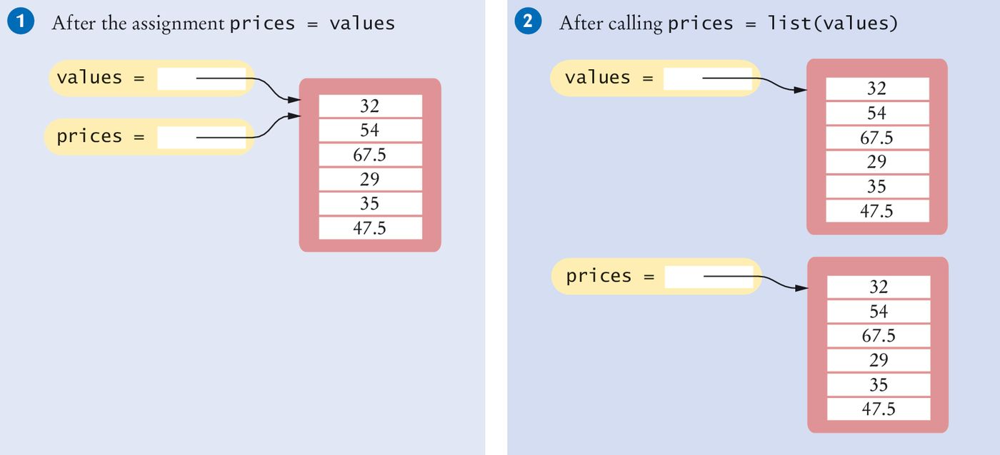
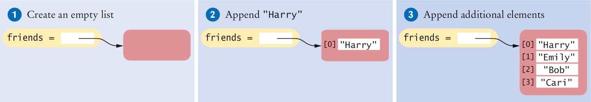
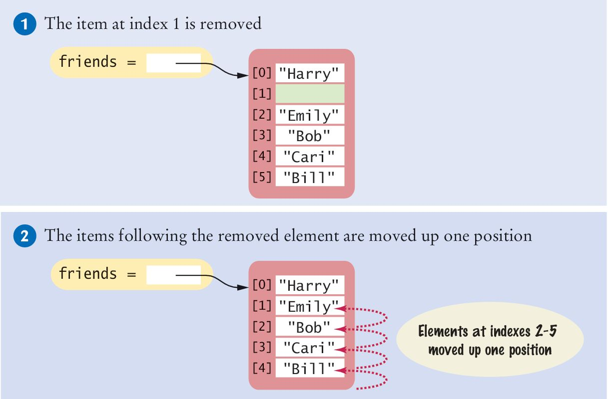
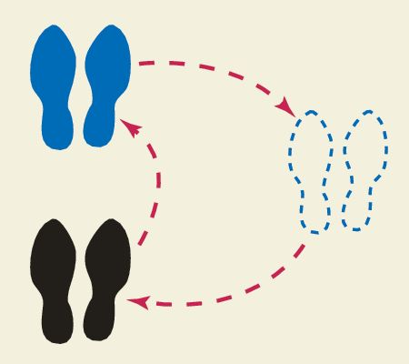
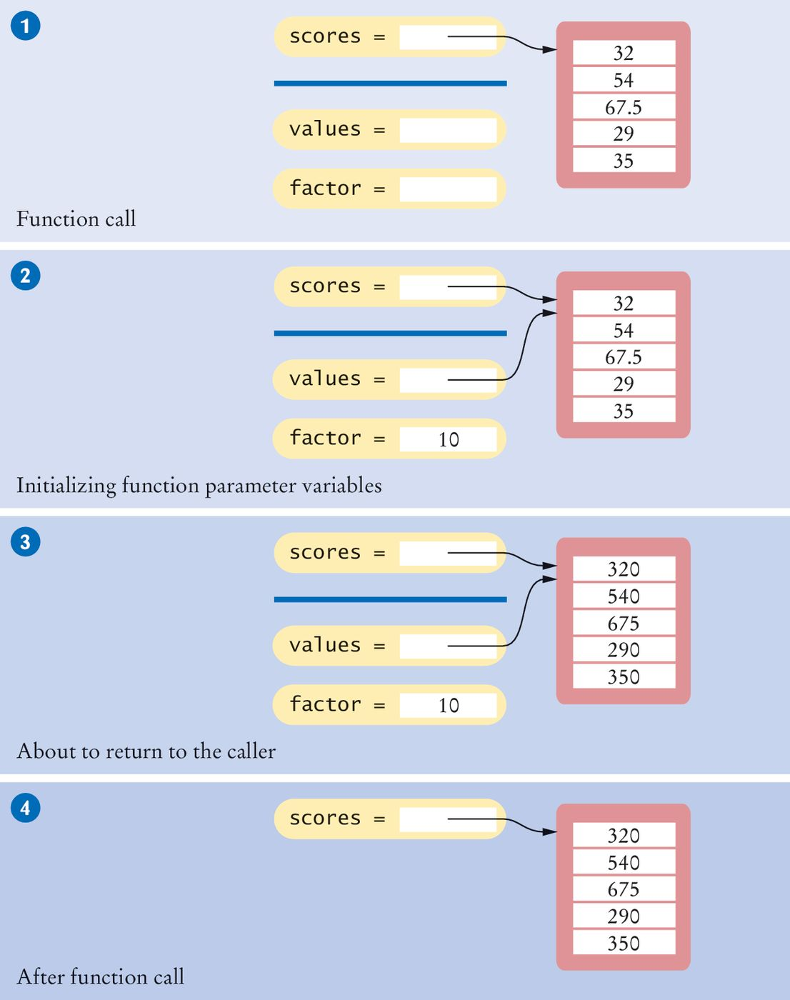

# Chapter Five: Lists

So far every variable has held a single value: one price, one name, one grade. Real programs work with **collections** — all the scores in a class, every temperature in a year, the names on a guest list. A **list** stores many values under one name, in order, and lets you add, remove, and change them as the program runs. In this chapter you will learn how to create and traverse lists, the algorithms that come up again and again when processing them, how lists behave when you pass them to functions, and how **tuples** differ from lists.

[← Back to Course Index](../table-of-contents.md)

---

## Chapter Goals

In this chapter you will **learn**:

- To collect elements using **lists**
- To use the **`for` loop** for traversing lists
- To learn **common algorithms** for processing lists
- To use lists with **functions**
- To understand **tuples** and how they differ from lists

---

## Chapter Contents

- **5.1 Basic Properties of Lists** — Creating lists, indexing, length, references, aliases, and copies
- **5.2 List Operations** — Adding, finding, and removing elements, concatenation, sorting, and slicing
- **5.3 Common List Algorithms** — Filling, combining, searching, counting, removing, swapping, and reading input
- **5.4 Using Lists with Functions** — Lists as arguments, modifying lists in a function, and returning lists
- **5.5 Tuples** — Immutable sequences and returning multiple values

---

## 5.1 Basic Properties of Lists

### Python Lists

A **Python list** is an ordered, mutable collection that can hold multiple items of different data types. Lists are one of the most commonly used data structures in Python.

**Key features of lists:**

- **Ordered:** Elements keep the order in which they were added.
- **Mutable:** You can modify lists by adding, removing, or changing elements.
- **Heterogeneous:** A list can store different data types (e.g., integers, strings, even other lists).
- **Dynamic:** Lists grow or shrink as needed.

### Syntax 5.1: Lists

```python
more_values = []                                # creates an empty list
values = [32, 54, 67, 29, 35, 80, 115]          # creates a list with initial values

values[i] = 0                                   # use brackets to access an element
element = values[i]
```

- A list is written as values separated by commas, inside square brackets `[]`.
- `[]` on its own creates an **empty list**.

### Creating a List

```python
values = [32, 54, 67.5, 29, 35, 80, 115, 44.5, 100, 65]
```

### Accessing List Elements

A list is a sequence of **elements**, each of which has an integer position or **index**. Indexes start at **0**. To access a list element, use the subscript operator `[]`, just as you did with individual characters of a string in §1.7:

```python
print(values[5])   # Accessing a list element: prints 80
values[5] = 87     # Replacing a list element
```

![Two panels: (1) the variable values refers to a list of ten elements 32 to 65; (2) the same list with indexes [0] to [9], where element [5] has been replaced by 87](media/list-create-and-access.jpeg)

### Lists vs. Strings

Both lists and strings are **sequences**, and the `[]` operator is used to access an element in any sequence. There are two important differences:

1. **Content:** Lists can hold values of any type; strings are sequences of characters.
2. **Mutability:** Strings are **immutable** — you cannot change the characters in a string. Lists are **mutable** — you can replace, add, and remove elements.

### ⚠️ Common Error: Out-of-Range Errors

A common error is accessing a nonexistent element. If your program uses an out-of-range index, Python stops with an exception at runtime:

```python
values = [2.3, 4.5, 7.2, 1.0, 12.2, 9.0, 15.2, 0.5]
values[8] = 5.4   # ❌ Error: values has 8 elements, indexes 0 to 7
```

```
IndexError: list assignment index out of range
```

Reading a missing element (`print(values[8])`) fails the same way, with the message `IndexError: list index out of range`.

### Determining List Length

Use the **`len()`** function to get the number of elements in a list:

```python
num_elements = len(values)
```

The valid indexes of a list are `0` through `len(values) - 1`.

### Looping Over a List

There are two ways to visit every element. If you need the **index** of each element, use `range(len(values))` so the loop adapts if the list size changes. If you only need the **elements**, loop over the list directly, as you looped over the characters of a string in §3.5:

```python
# Using the index
for i in range(len(values)):
    print(i, values[i])

# Without the index (traverse the elements directly)
for element in values:
    print(element)
```

### List References

A list variable does not hold the elements themselves. It holds a **reference** to the list contents — the location in memory where the list is stored.

![The list variable scores holds a reference — an arrow — pointing to the list contents, five values at indexes [0] to [4]](media/list-reference.png)

### List Aliases

When you assign one list variable to another, both variables refer to the **same** list. The second variable is an **alias** for the first.

```python
scores = [10, 9, 7, 4, 5]
values = scores   # Copies the reference; both names refer to the same list
```

You can modify the list through either variable, and the change is visible through both:

```python
scores[3] = 10
print(values[3])   # Prints 10
```

![Two panels: (1) after values = scores, both variables point to the same list; (2) after scores[3] = 10, element [3] changes to 10 and both variables see it](media/list-aliases.jpeg)

### Copying Lists

Because assigning `prices = values` only copies the reference, it does not give you a second list. To create a **new list** with the same elements, call **`list()`**:

```python
prices = list(values)   # New list with the same elements
```

The slice `values[:]` (see §5.2) also makes a new list with the same elements.



### Negative Indexes

As with strings (§1.7), Python supports **negative indexes** to access elements from the end: `-1` is the last element, `-2` the second-to-last, and so on.

```python
last = values[-1]
print(f"The last element in the list is {last}")
```

For `values = [32, 54, 67.5, 29, 35, 87, 115, 44.5, 100, 65]`:

| Element        | 32  | 54  | 67.5 | 29  | 35  | 87  | 115 | 44.5 | 100 | 65  |
| -------------- | --- | --- | ---- | --- | --- | --- | --- | ---- | --- | --- |
| Index          | 0   | 1   | 2    | 3   | 4   | 5   | 6   | 7    | 8   | 9   |
| Negative index | -10 | -9  | -8   | -7  | -6  | -5  | -4  | -3   | -2  | -1  |

---

## 5.2 List Operations

### Overview

Common list operations include:

- Appending and inserting elements
- Finding and removing elements
- Concatenation and replication
- Equality testing
- Sum, maximum, minimum, and sorting
- Slicing

### Appending Elements

Start with an empty list and add elements to the end with **`append()`**:

```python
friends = []
friends.append("Harry")
friends.append("Emily")
friends.append("Bob")
friends.append("Cari")
```



### Inserting an Element

Use **`insert(index, value)`** to add an element at a specific position. The elements at and after that position move down one place to make room:

```python
friends = ["Harry", "Emily", "Bob", "Cari"]
friends.insert(1, "Cindy")   # Insert at index 1
friends.insert(5, "Bill")    # Index 5 is the end of the list, so this appends
```

| Index | Original  | After `insert(1, "Cindy")` | After `insert(5, "Bill")` |
| ----- | --------- | -------------------------- | ------------------------- |
| 0     | `"Harry"` | `"Harry"`                  | `"Harry"`                 |
| 1     | `"Emily"` | **`"Cindy"`** (new)        | `"Cindy"`                 |
| 2     | `"Bob"`   | `"Emily"` (moved)          | `"Emily"`                 |
| 3     | `"Cari"`  | `"Bob"` (moved)            | `"Bob"`                   |
| 4     |           | `"Cari"` (moved)           | `"Cari"`                  |
| 5     |           |                            | **`"Bill"`** (new)        |

### Finding an Element

To check **whether** an element is in a list, use the **`in`** operator (or `not in` for the opposite):

```python
if "Cindy" in friends:
    print("She's a friend")
```

To get the **position** of the first occurrence, use **`index()`**:

```python
friends = ["Harry", "Emily", "Bob", "Cari", "Emily"]
n = friends.index("Emily")   # n is 1
```

If the item is not in the list, **`index()`** raises a **`ValueError`**:

```
ValueError: 'Dave' is not in list
```

Check with **`in`** first when the value might be missing:

```python
name = "Dave"
if name in friends:
    pos = friends.index(name)
    print(f"{name} is at position {pos}")
else:
    print(f"{name} is not in the list")
```

### Removing an Element (by Index)

The **`pop(i)`** method removes the element at position `i` and **returns** it. The elements after it move up one position, and the length of the list decreases by 1.

```python
friends = ["Harry", "Cindy", "Emily", "Bob", "Cari", "Bill"]
removed = friends.pop(1)   # Removes "Cindy" and returns it
print(removed)             # Cindy
print(friends)             # ['Harry', 'Emily', 'Bob', 'Cari', 'Bill']
```

If you call **`pop()`** with **no argument**, it removes and returns the **last** element in the list (the same as `pop(-1)`).



### Removing an Element (by Value)

Use **`remove(value)`** to remove the **first occurrence** of a value:

```python
numbers = [1, 2, 3, 4, 3]
numbers.remove(3)   # Removes the first 3 only
print(numbers)      # [1, 2, 4, 3]
```

If the value is not in the list, `remove` raises a `ValueError`:

```
ValueError: list.remove(x): x not in list
```

### Concatenation

The **`+`** operator concatenates two lists into a new list:

```python
my_friends = ["Fritz", "Cindy"]
your_friends = ["Lee", "Pat", "Phuong"]
our_friends = my_friends + your_friends
# our_friends is ['Fritz', 'Cindy', 'Lee', 'Pat', 'Phuong']
```

### Replication

The **`*`** operator with an integer creates a new list with repeated copies of the original — just like string repetition in §1.7:

```python
month_in_quarter = [1, 2, 3] * 4
# [1, 2, 3, 1, 2, 3, 1, 2, 3, 1, 2, 3]

monthly_scores = [0] * 12   # A list of 12 zeros
```

### Equality and Inequality

Use **`==`** and **`!=`** to compare lists. Two lists are equal when they have the same elements in the same order:

```python
[1, 4, 9] == [1, 4, 9]    # True
[1, 4, 9] == [4, 1, 9]    # False
[1, 4, 9] != [4, 9]       # True
```

### Sum, Maximum, Minimum

- **`sum(values)`** returns the sum of a list of numbers.
- **`max(values)`** and **`min(values)`** return the largest and smallest value (numbers or strings).

```python
sum([1, 4, 9, 16])           # 30
max([1, 16, 9, 4])           # 16
min(["Fred", "Ann", "Sue"])  # 'Ann'
```

### Sorting

The **`sort()`** method sorts a list **in place** — it changes the list itself:

```python
values = [1, 16, 9, 4]
values.sort()               # values is now [1, 4, 9, 16]
values.sort(reverse=True)   # values is now [16, 9, 4, 1]
```

`reverse=True` is a keyword argument (§4.3). If you want a sorted copy and need to keep the original order, use the built-in **`sorted()`** function, which returns a **new** list:

```python
values = [1, 16, 9, 4]
ordered = sorted(values)    # ordered is [1, 4, 9, 16]; values is unchanged
```

### Slices of a List

Slicing works on lists the same way it works on strings (§1.7). The syntax is **`values[start:stop:step]`**:

- **start:** Index where the slice starts (inclusive). Default: start of the list.
- **stop:** Index where the slice ends (exclusive). Default: end of the list.
- **step:** Interval between indexes. Default: 1.

Example: the third quarter of a year of monthly temperatures (July, August, September — indexes 6, 7, 8):

```python
temperatures = [18, 21, 24, 33, 39, 40, 39, 36, 30, 22, 18, 15]
third_quarter = temperatures[6:9]   # [39, 36, 30]
```

Omitted indexes mean "from the start" or "to the end":

```python
temperatures[:6]    # All elements up to (but not including) index 6
temperatures[6:]    # From index 6 to the end
temperatures[::3]   # Every third element: [18, 33, 39, 22]
```

A slice is a **new** list. You can also **assign** to a slice to replace part of a list:

```python
temperatures[6:9] = [45, 44, 40]
```

### Reference: Common List Functions and Operators

| Operation                      | Description                                                                                 |
| ------------------------------ | ------------------------------------------------------------------------------------------- |
| `[]`<br>`[elem1, elem2, ...]`  | Creates a new empty list, or a list that contains the elements provided.                     |
| `len(values)`                  | Returns the number of elements in `values`.                                                 |
| `list(sequence)`               | Creates a new list containing all elements of the sequence.                                 |
| `values * num`                 | Creates a new list by replicating the elements of `values` `num` times.                     |
| `values + more_values`         | Creates a new list by concatenating the elements of both lists.                             |
| `values[start:stop]`           | Creates a new list from the elements at `start` up to, but not including, `stop`. Both are optional. |
| `sum(values)`                  | Computes the sum of the values in the list.                                                 |
| `min(values)`<br>`max(values)` | Returns the minimum or maximum value in the list.                                           |
| `sorted(values)`               | Returns a new list with the elements in sorted order.                                       |
| `values1 == values2`           | Tests whether two lists have the same elements, in the same order.                          |
| `element in values`            | Tests whether `element` is in the list.                                                     |

### Reference: Common List Methods

| Method                            | Description                                                                                           |
| --------------------------------- | ----------------------------------------------------------------------------------------------------- |
| `values.append(element)`          | Appends the element to the end of the list.                                                           |
| `values.insert(position, element)` | Inserts the element at the given position. All elements at and after that position move down.       |
| `values.pop()`<br>`values.pop(position)` | Removes and returns the last element, or the element at the given position. All elements after it move up one place. |
| `values.remove(element)`          | Removes the first occurrence of the element. All elements after it move up one place.                 |
| `values.index(element)`           | Returns the position of the first occurrence of the element. The element must be in the list.         |
| `values.sort()`                   | Sorts the elements in place, from smallest to largest.                                                |

---

## 5.3 Common List Algorithms

### Overview

Many of the loop algorithms from §3.4 carry over directly to lists. Typical patterns include:

- Filling a list
- Combining elements (sum, concatenate)
- Element separators
- Maximum and minimum
- Linear search
- Collecting and counting matches
- Removing matches
- Swapping elements
- Reading input into a list

### Filling a List

Build a list in a loop. For example, the squares of 0, 1, 2, …, 9:

```python
n = 10
values = []
for i in range(n):
    values.append(i * i)
# values is [0, 1, 4, 9, 16, 25, 36, 49, 64, 81]
```

### Combining List Elements

**Sum of numbers** (the built-in `sum` does the same thing):

```python
result = 0.0
for element in values:
    result = result + element
```

**Concatenating strings:**

```python
result = ""
for element in names:
    result = result + element
```

### Element Separators

To display elements separated by commas (e.g., `Harry, Emily, Bob`), add the separator before each element **except the first**:

```python
names = ["Harry", "Emily", "Bob"]
result = ""
for i in range(len(names)):
    if i > 0:
        result = result + ", "
    result = result + names[i]
print(result)   # Harry, Emily, Bob
```

Or print the elements directly, using the `end` argument from §3.5:

```python
for i in range(len(values)):
    if i > 0:
        print(" | ", end="")
    print(values[i], end="")
print()
```

**Tip:** For a list of strings, the string method **`join()`** does this in one step:

```python
names = ["Harry", "Emily", "Bob"]
result = ", ".join(names)   # 'Harry, Emily, Bob'
```

### Maximum and Minimum

Start with the first element, then compare it with every remaining element — the same idea as §3.4, now applied to a list:

```python
largest = values[0]
for i in range(1, len(values)):
    if values[i] > largest:
        largest = values[i]

smallest = values[0]
for i in range(1, len(values)):
    if values[i] < smallest:
        smallest = values[i]
```

(The built-ins `max(values)` and `min(values)` give the same results.)

### Linear Search

To find the **position** of the first value greater than a limit, visit the elements one by one until you find a match or reach the end of the list:

```python
limit = 100
pos = 0
found = False
while pos < len(values) and not found:
    if values[pos] > limit:
        found = True
    else:
        pos = pos + 1

if found:
    print(f"Found at position: {pos}")
else:
    print("Not found")
```

### Collecting and Counting Matches

**Collect all matches** into a new list:

```python
limit = 100
result = []
for element in values:
    if element > limit:
        result.append(element)
```

**Count matches:**

```python
limit = 100
counter = 0
for element in values:
    if element > limit:
        counter = counter + 1
```

### Removing Matches

To remove all elements that meet a condition — for example, all words with fewer than four letters — use a `while` loop, and only move to the next index when you do **not** remove an element. When you remove an element, the next element moves into the current position, so the index must stay where it is:

```python
words = ["Welcome", "to", "the", "Python", "course"]
i = 0
while i < len(words):
    word = words[i]
    if len(word) < 4:
        words.pop(i)
    else:
        i = i + 1
# words is ['Welcome', 'Python', 'course']
```

Do **not** use a `for` loop for this. A `for` loop always moves on to the next index, so it skips the element that moved into the removed one's place.

### Swapping Elements

To swap the elements at positions `i` and `j`, use a temporary variable. Without it, the first assignment would overwrite a value before you had a chance to copy it:



```python
values = [32, 54, 67.5, 29, 34.5]
i = 1
j = 3

temp = values[i]
values[i] = values[j]
values[j] = temp
# values is [32, 29, 67.5, 54, 34.5]
```

![Four panels: (1) values[1] = 54 and values[3] = 29 are to be swapped; (2) temp = values[i] stores 54; (3) values[i] = values[j] copies 29 into index 1; (4) values[j] = temp copies 54 into index 3](media/swap-steps.jpeg)

**Tip:** Python can also swap two elements in one line, using the same comma syntax you used to return and unpack several values in §4.4:

```python
values[i], values[j] = values[j], values[i]
```

### Reading Input

Read values from the user and store them in a list, stopping at a sentinel (§3.3):

```python
values = []
print("Please enter values, Q to quit:")
user_input = input("")
while user_input.upper() != "Q":
    values.append(float(user_input))
    user_input = input("")
```

---

## 5.4 Using Lists with Functions

### Lists as Arguments

A function can take a list as an argument. This function computes the sum of a list without changing it:

```python
def total(values):
    """Computes the sum of the values in a list.

    values: a list of numbers
    Returns the sum of the elements in values.
    """
    result = 0
    for element in values:
        result = result + element
    return result
```

### Modifying List Elements

Because a list is **mutable**, a function can also change the elements of a list it receives:

```python
def multiply(values, factor):
    """Multiplies all elements of a list by a factor.

    values: a list of numbers, modified in place
    factor: the value to multiply each element by
    """
    for i in range(len(values)):
        values[i] = values[i] * factor


scores = [32, 54, 67.5, 29, 35]
multiply(scores, 10)
print(scores)   # [320, 540, 675.0, 290, 350]
```

When you call `multiply(scores, 10)`, the parameter `values` is initialized with the **reference** stored in `scores`. Both variables refer to the same list, so the changes made through `values` are visible through `scores` after the call.



In §4.3 you learned not to assign new values to parameter variables. Changing the *contents* of a list parameter is different: here it is the whole job of the function. When a function modifies a list it is given, say so in its docstring, as `multiply` does.

### Parameter Passing in Python

When you call a function, Python initializes each parameter variable with a **reference** to the same object the argument refers to. This is true for every type. What matters is what the function then does with the parameter:

- **Reassigning** the parameter (`n = 10`, `numbers = [0, 0, 0]`) makes the local variable refer to a different object. The caller's variable is not affected.
- **Mutating** the object (`numbers[0] = 99`, `numbers.append(4)`) changes the one object that both the caller and the function refer to. The caller sees the change.

Numbers, strings, and tuples are **immutable** — they have no operations that change them in place — so a function can never change a caller's number or string. Lists are **mutable**, so a function can change a caller's list.

```python
def try_change_int(n):
    n = 10            # Reassigns local n; the caller's variable is unchanged


def try_change_list(numbers):
    numbers[0] = 99   # Mutates the list; the caller's list changes


x = 5
try_change_int(x)
print(x)       # 5

nums = [1, 2, 3]
try_change_list(nums)
print(nums)    # [99, 2, 3]
```

### Returning Lists from Functions

A function can build a new list and return it. Example: a list of the squares from 0² to (n − 1)²:

```python
def squares(n):
    """Creates a list of the squares of 0, 1, ..., n - 1.

    n: the number of squares
    Returns a list of n squares.
    """
    result = []
    for i in range(n):
        result.append(i * i)
    return result


print(squares(5))   # [0, 1, 4, 9, 16]
```

---

## 5.5 Tuples

A **tuple** is like a list but **immutable**: once created, its contents cannot be changed. Tuples are written with parentheses instead of square brackets:

```python
triple = (5, 10, 15)
triple = 5, 10, 15   # The parentheses are optional
```

A tuple with **one** element needs a trailing comma — `(5,)` is a tuple, but `(5)` is just the number 5 in parentheses.

**Why use tuples?**

- **Immutability:** Fixed data that should not be modified; safe to pass to functions or share without accidental changes.
- **Performance:** Slightly faster and smaller than lists when the collection does not need to change.
- **Usable as keys:** Unlike lists, tuples can be used as keys in **dictionaries** and as elements of **sets** (both covered in a later chapter), because their contents cannot change.

### Some Use Cases

- **Coordinates or points:** `point = (x, y)` or `point = (x, y, z)` — a position in 2D or 3D space should not change by accident.
- **Multiple return values:** Functions that produce several values (e.g., quotient and remainder, or min and max) return a tuple; callers unpack it with `a, b = f()`.
- **Constants:** Fixed sequences such as `RGB_WHITE = (255, 255, 255)` that should not be altered after creation.

### Returning Multiple Values

In §4.4 you returned several values from a function with `return first, second` and unpacked them with `low, high = min_max(10, 3)`. The "one combined result" Python sends back is a **tuple**:

```python
def read_date():
    """Reads a date from the user.

    Returns the month, day, and year as a tuple of integers.
    """
    print("Enter a date:")
    month = int(input("Month: "))
    day = int(input("Day: "))
    year = int(input("Year: "))
    return (month, day, year)


date = read_date()                # date is a tuple, such as (10, 7, 2026)
month, day, year = read_date()    # or unpack it into three variables
```

### Tuples vs. Lists: What Works and What Doesn't

Because tuples are **immutable**, not every list operation works on them.

**Operations that work with tuples (as with lists):**

- **Indexing:** `t[i]`, `t[-1]` — access by position.
- **`len(t)`** — number of elements.
- **`in`** — test whether a value is in the tuple.
- **Slicing:** `t[start:stop:step]` — returns a **new** tuple.
- **Concatenation:** `t1 + t2` — returns a new tuple.
- **Iteration:** `for x in t:` or `for i in range(len(t)):`.
- **`index(value)`** — position of the first occurrence (raises `ValueError` if not found).
- **`count(value)`** — number of times a value appears.
- **`sum(t)`**, **`max(t)`**, **`min(t)`** — when the elements are numbers or otherwise comparable.

**Operations that do *not* work with tuples:**

- **Assignment to an element:** `t[i] = x` is not allowed:
  ```
  TypeError: 'tuple' object does not support item assignment
  ```
- **`append()`**, **`insert()`** — tuples have no methods that add elements.
- **`pop()`**, **`remove()`** — tuples have no methods that remove elements.
- **`sort()`** — tuples have no in-place sort. Use **`sorted(t)`** to get a **list** of the elements in order; the tuple itself is unchanged.

Calling a method that tuples do not have stops the program with an error such as:

```
AttributeError: 'tuple' object has no attribute 'append'
```

In short: anything that **reads** a tuple or **builds a new** one is fine; anything that **changes** the tuple in place is not.

---

## Key Takeaways

1. **Lists** are ordered, mutable sequences. Access elements with **`values[i]`** (indexes start at 0, and negative indexes count from the end); traverse them with `for element in values` or `for i in range(len(values))`
2. Using an index outside `0` to `len(values) - 1` causes an **`IndexError`**
3. A list variable holds a **reference**. Assigning it to another variable creates an **alias**; use **`list(values)`** or **`values[:]`** to make a copy
4. Common operations include **`append`**, **`insert`**, **`pop`**, **`remove`**, **`in`**, **`index`**, **`+`**, **`*`**, slicing, and **`sort()`**; built-ins such as **`len`**, **`sum`**, **`max`**, **`min`**, and **`sorted`** work on lists
5. **List algorithms** follow the loop patterns from Chapter 3: fill a list in a loop, combine elements, scan for the maximum or minimum, search for a match, collect or count matches, and remove items carefully with a `while` loop
6. Swap two elements with a **temporary variable** (or with `a, b = b, a`)
7. Passing a list to a function passes a **reference** — **mutating** the list inside the function changes the caller's list; **reassigning** the parameter does not
8. **Tuples** are like lists but **immutable**; use them for fixed data and for returning multiple values from a function

---

*End of Chapter Five*

[← Back to Course Index](../table-of-contents.md)
